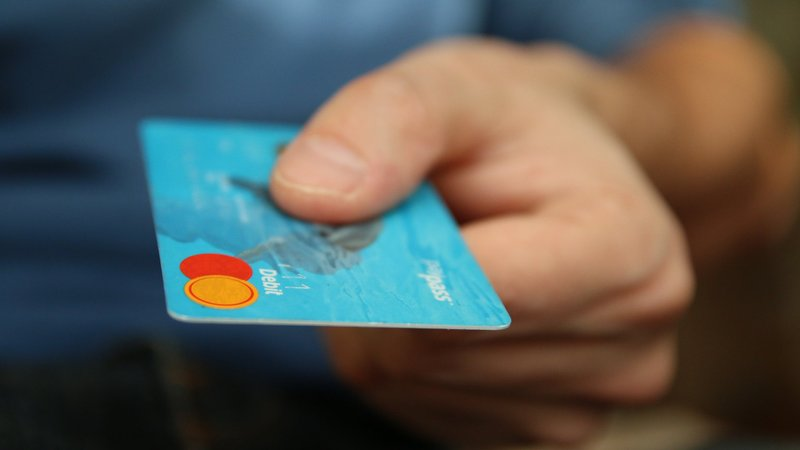
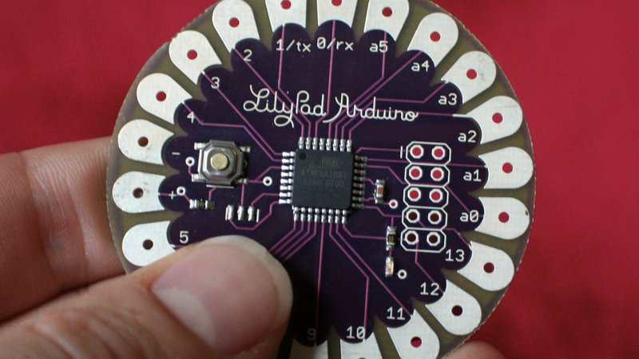
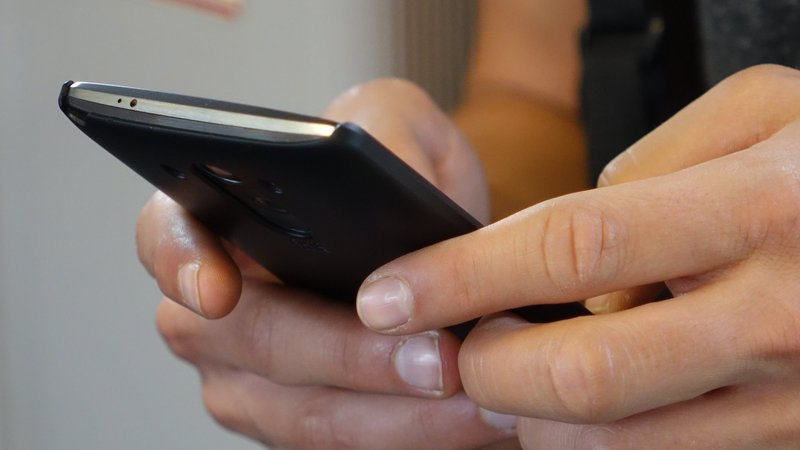
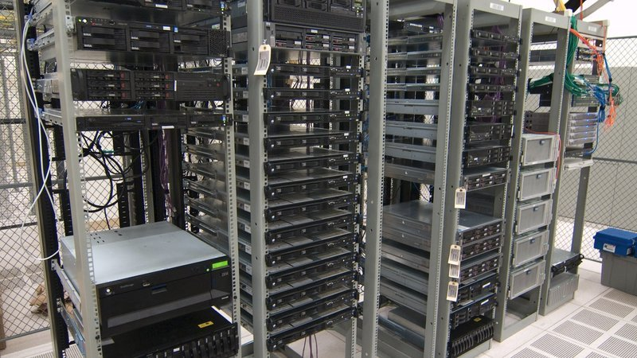
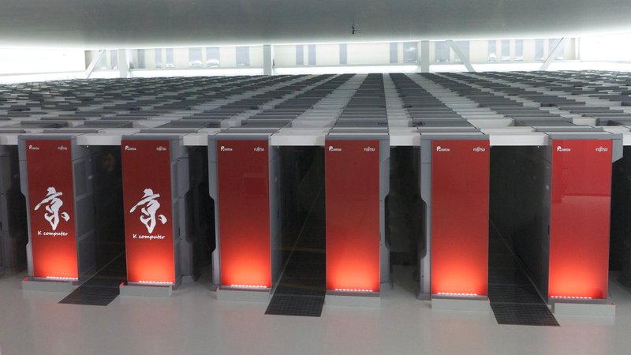

# 1.1 Computerkategorien
---

Computer gibt es in sehr unterschiedlichen Grössen. Supercomputer füllen grosse Hallen. Deutlich kleiner sind alltägliche Computersysteme wie Laptops oder Smartphones. Die kleinsten Computersysteme finden auf einem einzigen Mikrochip platz und werden in vielen alltäglichen Geräten verbaut. Sie können grob in folgende sieben Kategorien unterteilt werden[^1]:

| Typ                            | Anwendungsbeispiel                 | Preis (USD) |
| ------------------------------ | ---------------------------------- | -----------:|
| Wegwerfcomputer                | Karten, RFID-Tags                  |         0.5 |
| Mikrocontroller                | Uhren, Autos, Geräte               |           5 |
| Mobile Computer, Spielkonsolen | Heimvideospiele und Smartphones    |          50 |
| Personalcomputer (PC)          | Desktop- oder Notebook-Computer    |         500 |
| Server                         | Netzwerkserver                     |       5'000 |
| Grossrechner (Mainframe)       | Zahlungsverarbeitung in einer Bank |   5'000'000 |
| Supercomputer                  | Forschung                          | 100'000'000 |

::: columns 3

***

***

***

***

***

:::

[^1]: Andrew S. Tanenbaum und Todd Austin: Rechnerarchitektur, 2014, 6. Auflage, S. 49
