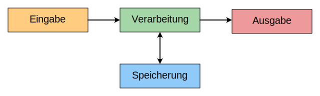

# 1.2 EVAS-Prinzip
---

Das **EVAS-Prinzip** beschreibt ein Grundprinzip der Datenverarbeitung. Die Abkürzung leitet sich aus den ersten Buchstaben der Begriffe **Eingabe**, **Verarbeitung**, **Ausgabe** und **Speicherung** ab.

Daten müssen zuerst in den Computer gelangen. Dazu ist ein **Eingabegerät** notwendig, welches Informationen aus der Umwelt in Daten umwandelt. Diese Informationen können Bewegungen oder Aktionen des Benutzers, Messwerte oder digitale Nachrichten eines anderen Computers sein.

Im Gerät werden die Daten **gespeichert** und **verarbeitet**.

Ein **Ausgabegerät** wandelt Daten wieder in Informationen für die Umwelt um. Diese können beispielsweise visuell oder akustisch sein, um die Sinne der Benutzers anzusprechen. Es können aber auch um digitale Nachrichten an andere Computer weitergeleitet werden.

## Ein- und Ausgabegeräte

Typische Ein- und Ausgabegeräte für Computer sind:

::: columns 3

***

***

***

***

***

:::

::: exercise Aufgabe
Welche Möglichkeiten für die Ein- und Ausgabe von Daten hat dein Smartphone? Versuche, möglichst alle aufzuschreiben. Bilde folgende Kategorien:

- nur Eingabegerät
- Ein- und Ausgabegerät
- nur Ausgabegerät
:::
