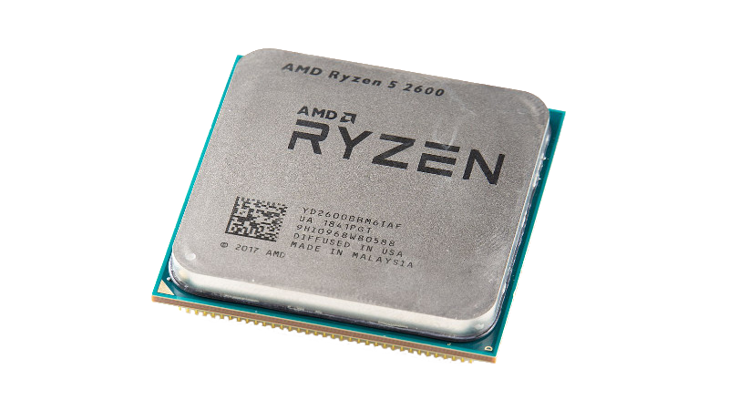
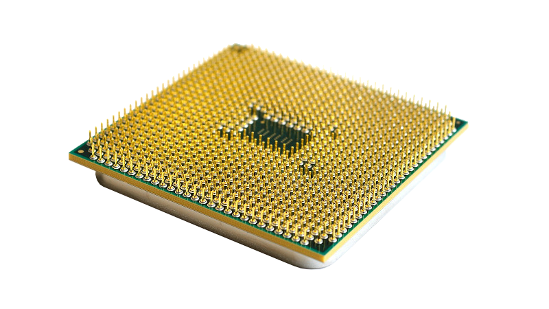
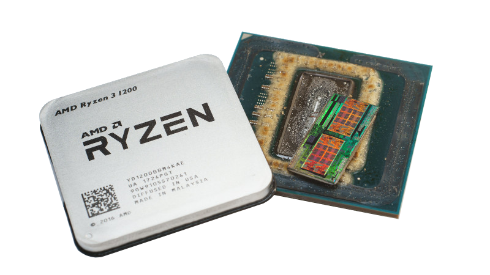

# 1.3 Prozessor
---

Der Prozessor ist für die **Verarbeitung** von Daten im Computer zuständig. Ausserdem überwacht und steuert er den Ablauf von Programmen.

Moderne Prozessoren enthalten mehrere **Kerne**, welche unabhängig voneinander Programme ausführen und Berechnungen vornehmen können.

## Kenngrössen

Für den Prozessor gibt es folgende wichtige Kenngrössen:

- Die Anzahl **Kerne** gibt an, wie viele Berechnungen ein Prozessor gleichzeitig ausführen kann.
- Die **Taktfrequenz** gibt an, wie schnell der Prozessor Berechnungen durchführen kann. Sie wird in der Einheit **Hertz** angegeben, was «pro Sekunde» bedeutet.

::: columns 3

***

***

:::

## Aufgaben

Der Prozessor hat zwei Hauptaufgaben. Einerseits **kontrolliert** er die Ausführung der Programmanweisungen. Dabei **steuert** er alle anderen Komponenten des Computers.

Andererseits **verarbeitet** der Prozessor Daten. Das heisst, er führt mathematische oder logische Operationen mit binären Zahlen aus, beispielsweise:

- Vergleichen
- Addieren
- Multiplizieren
- Bits um eine Stelle nach links schieben

Im Kapitel [Rechnerarchitektur](?page=2-0-architecture) wird die Funktionsweise des Prozessors genauer erklärt.

## Weitere Funktionen

Im moderne Prozessor-Chips werden auch weitere Funktionen integriert, welche früher von separaten Bauteilen übernommen wurden.

Moderne Desktop-Prozessoren enthalten normalerweise eine Grafikeinheit, welche die Darstellung von Text, Bild und Video auf einem Bildschirm übernimmt.

Bei Prozessoren für Mobiltelefon werden üblicherweise spezialisierte Funktionen für GPS, W-LAN, Mobilfunk und Bluetooth auf dem Chip integriert. Dabei spricht man von einem Ein-Chip-System oder SoC (engl. *system on a chip*).

## Aufbau

TODO

## Mooresches Gesetz

::: exercise Aufgaben Prozessor
1. Prozessoren sind «Multitasking»-fähig. Wie kann ein Prozessor (resp. ein Kern alleine) mehrere Dinge «gleichzeitig» tun?
:::
