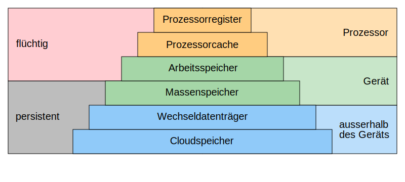

# 1.4 Speicher
---

::: warning
TODO: Nicht flüchtig und flüchtig, RAM, HD, SSD
:::

Datenspeicher speichern Daten üblicherweise in binärer Form. Ein Datenspeicher besteht aus einem Speichermedium, auf welchem die Bits physikalisch repräsentiert werden.

## Kenngrössen

Für Speicher gibt es drei wichtige Kenngrössen:

- Die **Speicherkapazität** ist die Datenmenge, welcher der Speicher maximal aufnehmen kann. Sie wird in Byte angegeben.
- Die **Zugriffszeit** ist die Zeit, die benötigt wird, um eine Dateneinheit (z.B. ein Byte) aus dem Speicher auszulesen. Die Zugriffszeit für das Speichern von Daten ist oft grösser als die Zugriffszeit für das Laden.
- Aus der Zugriffszeit kann die **Datenübertragungsrate** berechnet werden, also die Datenmenge, die innerhalb einer bestimmten Zeit geladen oder gespeichert werden kann. Die Datenübertragungsrate wird in Byte pro Sekunde angegeben.

## Arbeitsspeicher (RAM)

Der Arbeitsspeicher oder das RAM (engl. *random access memory*) enthält die Befehle und Daten der aktuell geöffneten Programme oder Apps. Der Prozessor muss möglichst schnell auf diese Daten zugreifen können. Der Arbeitsspeicher muss also eine möglichst kleine Zugriffszeit haben.

Dafür werden Nachteile in Kauf genommen. So ist die Speicherkapazität von Arbeitsspeicher eher klein. Ausserdem ist Arbeitsspeicher **flüchtig**. Die bedeutet, dass die Daten verloren gehen, sobald der Speicher nicht mehr mit Strom versorgt wird.

Heute wird in Computern normalerweise sogenanntes DDR-SDRAM[^1] eingesetzt. Es zeichnet sich dadurch aus, dass die Daten alle paar Millisekunden wieder neu geschrieben werden müssen (*Refresh*).

## Festplatten (HDD, SSD)

## Speicherhierarchie

Aus technischen Gründen sind schnelle Speicher viel teurer als langsame Speicher. Ausserdem sind schnelle Speicher **flüchtig**, sie benötigen eine Stromzufuhr, um den Speicherinhalt bewahren zu können.

Das führt dazu, dass schneller Speicher in viel kleineren Mengen und nur wo unbedingt nötig eingesetzt wird. Es ergibt sich in Computersystemen eine Hierarchie von verschiedenen Speichern. Je näher der Speicher beim Prozessor ist, desto schneller muss er sein.

::: exercise Aufgabe Speicherhierarchie

:::

[^1]: DDR-SDRAM: engl. *Double Data Rate Synchronous Dynamic Random Access Memory*
