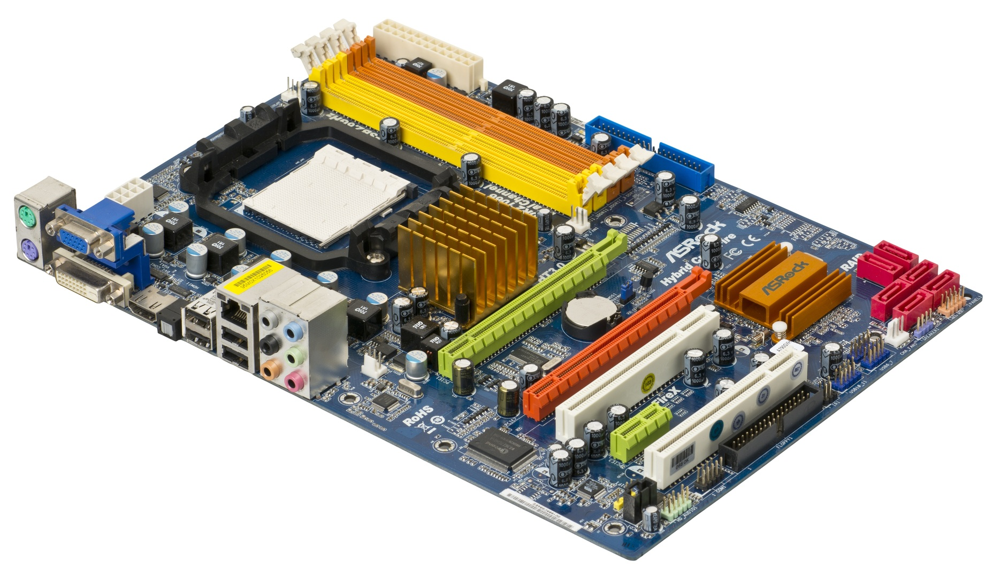
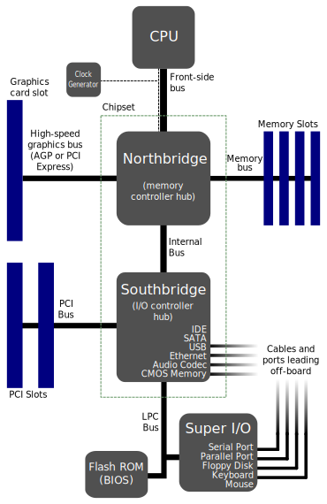
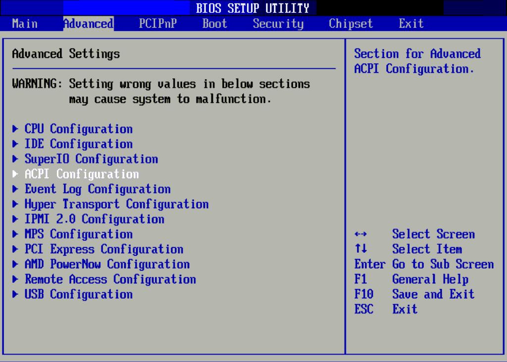
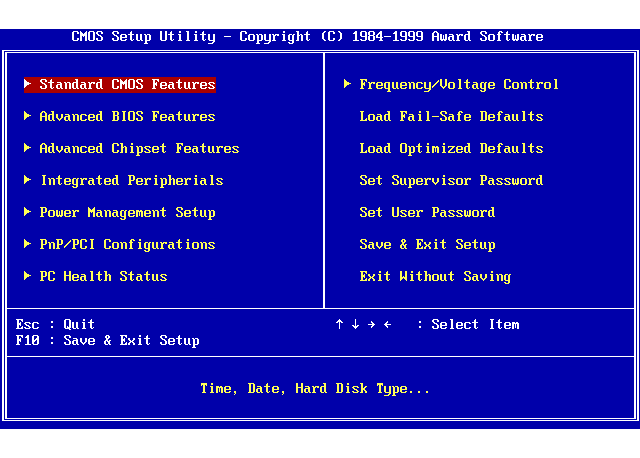

# 1.7 Hauptplatine
---

Der Grundbestandteil eines jeden Computers ist seine Hauptplatine (engl. *mainbaord* oder auch *motherboard* genannt). Die Elektronik auf der Hauptplatine verbindet Prozessor, RAM, etliche weitere verbaute Chips und sämtliche Peripherie, die über die zahlreichen Anschlüssen mit dem Computer verbunden werden kann.

## Aufbau

Hauptplatinen von modernen Computern sind stets ähnlich aufgebaut, sie bestehen aus den beiden wichtigen Komponenten **Northbridge** und **Southbridge**, die gemeinsam als **Chipsatz** bezeichnet werden.

Im nachfolgenden Schema sieht man gut, dass über die Northbridge diejenigen Computerkomponenten verbunden sind, die besonders schnell miteinander kommunizieren müssen: Prozessor, RAM und allenfalls schnelle Grafikkarten.

Über die Southbridge werden die restlichen Komponenten verbunden, so zum Beispiel Festplatten, Erweiterungskarten (wie z.B. Grafik- oder Netzwerkkarten) und das BIOS (*basic input and output system*).

In modernen Systemen wird die Northbridge oft auch direkt im Prozessor integriert, zudem enthält die Southbridge meist einen Netzwerk- und Grafikkontroller.

::: exercise Aufgaben Hauptplatine
1. Betrachte das ASRock Mainboard. Wo werden die folgenden Komponenten eingesteckt?
   - Prozessor
   - RAM
   - Festplatten
   - allenfalls benötigte zusätzliche Grafik- und Netzwerkkarten
2. Wie wird die Hauptplatine mit Strom versorgt?
3. Welche externen Anschlüsse (für Peripherie wie Bildschirm, Maus, ...) gibt es auf dieser Hauptplatine?
4. Finde auf dem ASRock Mainboard die North- und die Southbridge. Womit werden die beiden Chips verdeckt? Begründe!
:::

## BIOS

Beim Starten des Computers wird als erstes das BIOS (engl. *basic input and output system*) aktiv. Das BIOS erkennt die eingebaute Hardware und sorgt dafür, dass ein Betriebssystem gestartet werden kann. Basierend auf der gespeicherten Konfiguration entscheidet das BIOS, welcher Datenträger als Grundlage für den Startvorgang dient. Dies ist in der Regel eine eingebaute Festplatte, kann aber auch eine CD/DVD oder USB-Stick sein.

Um die BIOS-Konfiguration zu ändern, muss kurz nach dem Start eine bestimmte Taste gedrückt werden. In der Regel wird dies kurz auf dem Bildschirm eingeblendet. Die häufigsten Tasten sind: [F1], [F2], [Del], [Enter]

Je nach Konfiguration muss noch ein Passwort eingegeben werden, bevor die BIOS-Einstellungen angezeigt oder verändert werden können.

Es gibt verschiedene BIOS-Hersteller. Die Oberfläche ist sehr schlicht und einfach gestaltet. Man navigiert mit den Pfeiltasten, wählt mit [Enter] einen Eintrag aus und beendet ein Menü mit Hilfe von [Esc]. Nachfolgend zwei Beispiele:

::: columns 2

***

:::
