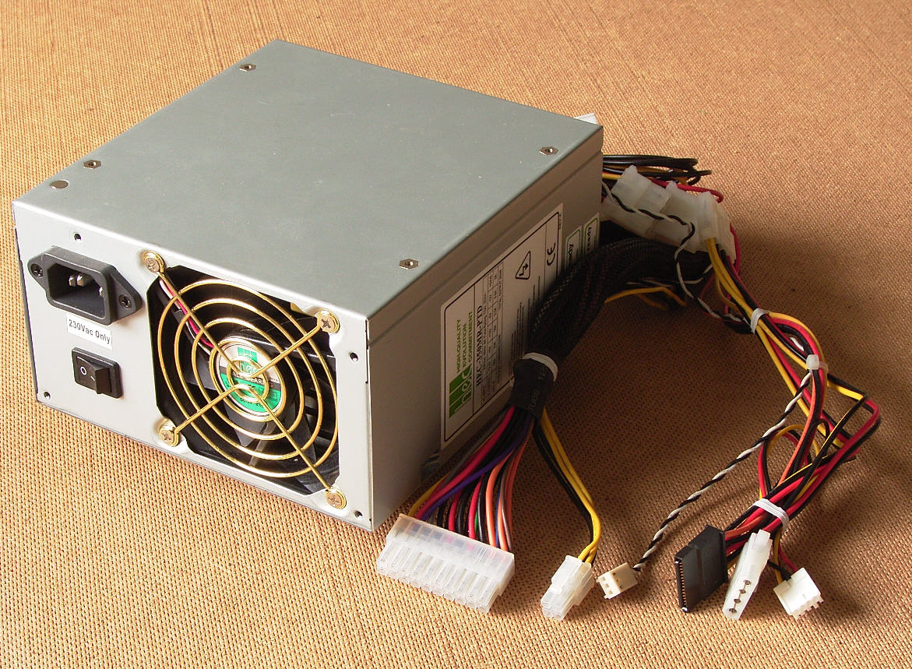

# 1.8 Stromversorgung
---

Die Stromversorgung eines Computers erfolgt über Gleichstrom (DC), das heisst, dass der Wechselstrom unseres Stromnetzes zuerst in Gleichstrom umgewandelt werden muss. Diese Funktion übernimmt das Netzteil.

Das Netzteil eines Desktop-Computers ist stets eingebaut. Bei einem Notebook hingegen übernimmt ein externes Netzteil die Stromtransformation, da im Innern des Notebooks nicht genügend Platz dafür vorhanden ist.

::: columns 2

***

:::

## Leistung

TODO

::: exercise Aufgaben Stromversorgung
1. Recherchiere im Internet und finde heraus, wie viel Leistung (Watt) folgende Geräte typischerweise im Betrieb beziehen:
   - Staubsauger
   - Desktop-PC-Netzteil
   - Notebook-Netzteil
   - Smartphone-Ladegerät
   - LED-Lampe
2. Wie beurteilen Sie folgende Aussagen?
   - Der Gamingcomputer eines Kollegen braucht ein 1500W-Netzteil.
   - Eine Stereoanlage verbraucht im Standbyzustand 15W.
   - Ein Beamer hat einen Standbyverbrauch von 0.5W.
:::
