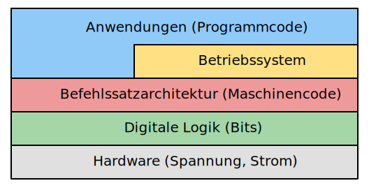

# Ebenen
---

Wie die Netzwerken kann auch die Hardware auf verschiedenen **Ebenen** betrachtet werden.

## Elektronik

- Spannung, Strom, ...

## Digitale Logik

- Bits

## Rechnerarchitektur

- Maschinencode

## Betriebssystem

## Anwendungen
