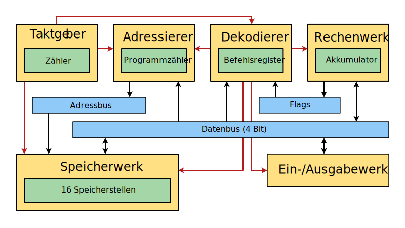

# Tetra
---

Tetra ist ein 4-Bit-Modellrechner, welcher die Funktionsweise eines Computers auf den Ebenen des Befehlssatzes und der Mikroarchitektur veranschaulicht.

## Architektur

Der Modellrechner orientiert sich an der Von Neumann-Architektur. Er hat einen Adress- und einen Datenbus mit einer Breite von je 4 Bit. Somit besitzt der Rechner einen maximalen Speicher von 16 Wörtern, d.h. 8 Byte. Das Steuerwerk ist aufgeteilt in den Adressierer, den Dekodierer und den Taktgeber.



Der Rechner besitzt vier Register:
- Programmzähler
- Befehlsregister
- Akkumulator
- Flag-Register

Ausserdem besitzt der Rechner einen Ein-/Ausgabe-Schnittstelle (engl. *input/output, I/O*).

## Befehlssatz

Der Modellrechner hat einen Befehlssatz mit variabler Länge. Die Instruktionen werden mit 4 Bit codiert, es stehen also 16 Instruktionen zu Verfügung. Manche Instruktionen haben zusätzlich einen Operanden. Der Befehlssatz deckt folgende Operationen ab:

| Code | Kurz | Operand | Beschreibung                               |
| ----:|:---- |:-------:|:------------------------------------------ |
|    0 | HCF  |  nein   | Halte Programm an                          |
|    1 | INP  |  nein   | Lade Wert von Eingabe in Akkumulator       |
|    2 | OUT  |  nein   | Schreibe Wert von Akkumulator nach Ausgabe |
|    3 | RND  |  nein   | Zufallszahl in Akkumulator                 |
|    4 |      |         |                                            |
|    5 |      |         |                                            |
|    6 | LDI  |   ja    | Lade Konstante in Akkumulator              |
|    7 | LDS  |   ja    | Lade Speicherstelle in Akkumulator         |
|    8 | ADI  |   ja    | Addiere Konstante zu Akkumulator           |
|    9 | ADS  |   ja    | Addiere Speicherstelle zu Akkumulator      |
|   10 | SBI  |   ja    | Subtrahiere Konstante von Akkumulator      |
|   11 | SBS  |   ja    | Subtrahiere Speicherstelle von Akkumulator |
|   12 | STO  |   ja    | Speichere Akkumulator in Speicherstelle    |
|   13 | JMP  |   ja    | Springe                                    |
|   14 | JEQ  |   ja    | Springe, falls Gleich-Flag gesetzt ist     |
|   15 | JLS  |   ja    | Springe, falls Kleiner-Flag gesetzt ist    |


## Ablaufsteuerung

Ein Befehl wird gemäss dem Von-Neumann-Zyklus abgearbeitet:
- **Befehlsabruf** (engl. *fetch*): Die nächste Instruktion wird aus dem Speicher über den Datenbus in das Befehlsregister übertragen. Der Programmzähler wird um eins erhöht.
- **Dekodierung** (engl. *decode*): Das Steuerwerk setzt die Instruktion in Steuersignale an die verschiedenen Komponenten um.
- **Operandenabruf** (engl. *fetch operands*): Manche Instruktionen benötigen zusätzliche Daten, z.B. eine Speicheradresse. Diese wird nun aus dem Speicher geladen, der Befehlszähler wird wieder entsprechend erhöht.
- **Befehlsausführung** (engl. *execute*): Das Rechenwerk führt die arithmetische oder logische Operations aus.

## Beispiele

Zwei Zahlen einlesen und addieren (Platzbedarf 8):
```
INP
STO 15
INP
ADS 15
OUT
HCF
```

In Zweierschritt bis 10 zählen (Platzbedarf 12):
```
LDS 15
OUT
ADI 2
STO 15
SBI 10
JLS 2
HCF
```

Ratespiel (Platzbedarf 14):
```
RND
STO 15
INP
SBS 15
JEQ 10
JMP 3
LDI 1
OUT
HCF
```
