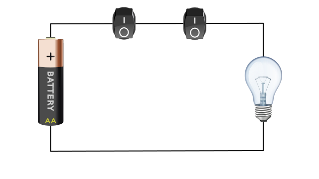

# AND-Gatter
---

Die Grundlage der Digitalelektronik bilden Schaltungen, welche einen oder zwei **Eingänge** und einen **Ausgang** haben. Solche Schaltungen heissen **Gatter**.

## AND-Gatter (*AND-gate*)

Ein AND-Gatter ist eine Schaltung, welche zwei Eingänge und einen Ausgang hat. Der Ausgang Y hat nur dann den Wert 1, wenn Eingange A **und** Eingang B den Wert 1 haben.

| A   | B   |   Y |
|:--- |:--- | ---:|
| 0   | 0   |   0 |
| 0   | 1   |   0 |
| 1   | 0   |   0 |
| 1   | 1   |   1 |

In Schaltplänen wird ein AND-Gatter mit folgendem Symbol dargestellt:

## Beispiel Lichtschalter

## Interaktive Schaltung

<iframe width="600px" height="400px" src="https://circuitverse.org/simulator/embed/and-gatter" id="projectPreview" scrolling="no" webkitAllowFullScreen mozAllowFullScreen allowFullScreen></iframe>

## Beispiele
