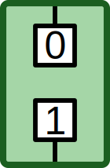
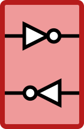
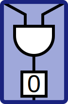
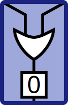
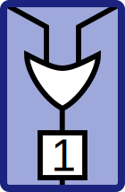
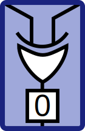
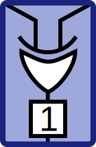
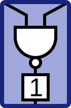
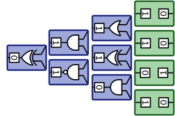
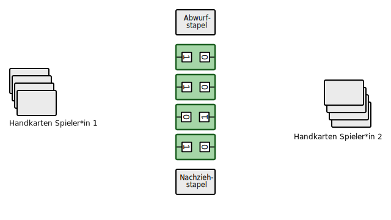

# Digitalo[^1]
---

Digitalo ist ein Kartenspiel, bei welchem zwei Spieler*innen versuchen, aus Gatter-Karten eine pyramidenförmige logische Schaltung aufzubauen.

## Karten

::: columns 4

***

***

***

***

***

***

***

***

***

:::

## Spielziel

Das Ziel des Spiels ist es, eine gültige Schaltungspyramide aufzubauen. Eine Gatterkarte darf nur so angelegt werden, dass sich ihr Wert (0 oder 1) durch das abgebildete Gatter aus den zwei Einganswerten ergibt.

Die folgende Abbildung zeigt eine korrekte vollständige Schaltungspyramide:

## Spielvarianten

Es gibt verschiedene Spielvarianten.

**Anzahl Eingänge:** Es können anstelle von vier auch fünf oder mehr Bit-Karten als Eingänge ausgelegt werden. Die Schaltungspyramiden werden entsprechend grösser und das Spiel dauert länger.

**Inverter:** Es kann mit Inverter-Karten gespielt werden. Siehe unten.

## Spielvorbereitung

Die Spieler*innen sitzen sich gegenüber.

1. Die Bit-Karten werden gemischt und in der Tischmitte in einer Reihe ausgelegt, so dass die 0 und 1 zufällig einer Spielerin bzw. einem Spieler zugewandt sind.
2. Die Gatter-Karten werden gemischt. Jeder Spielerin und jedem Spieler werden vier Gatter-Karten verteilt.
3. Die restlichen Gatter-Karten werden als Nachziehstapel neben die Bit-Karten in die Tischmitte gelegt.
4. Die Spieler*innen bestimmten, wer beginnt.

## Spielablauf

Die Spieler*innen kommen abwechselnd an die Reihe. Wer an der Reihe ist, kann eine Handkarte an seine Schaltung anlegen. Kann keine Karte gültig angelegt werden, so muss eine Karte abgeworfen werden.

Anschliessend wird eine Karte vom Nachziehstapel aufgenommen. Ist der Nachziehstapel leer, so wird der Abwurfstapel gemischt und als neuer Nachziehstapel verwendet.

Wenn die letzte Karte an eine Schaltungspyramide angelegt wird, endet das Spiel. Die andere Spielerin bzw. der andere Spieler kann allenfalls noch einen Zug machen, so dass beide Spieler*innen gleich viele Züge gemacht haben.

Falls beide Spieler*innen ihre Pyramide fertig gestellt haben, ist unentschieden. Ansonten erhält die Gewinnerin bzw. der Gewinner für jede fehlende Schaltung beim Gegner einen Punkt.

Es werden weitere Spielrunden gespielt, bis jemand 10002 Punkte erreicht hat. Die Punkte werden binär gezählt!

::: example

Machen wir ein Beispiel und spielen mit offenen Karten: Spieler 1 ist an der Reihe (s. Abbildung).

Er hat für seine Pyramide sechs Anlegemöglichkeiten bei vier Binärkarten. Da man Pyramiden - ebenso wie Häuser - von unten nach oben, oder hier von rechts nach links (beginnend an den Binärkarten) baut, kann Spieler 1 zur Zeit nur an die Positionen 1 bis 3 eine Gatterkarte anlegen.

Möglich wäre z.B. das OR-Gatter mit Ausgang 1 (oberste Handkarte) an die Positionen 1 bis 3 zu legen, da

- für die Position 1 gilt: 1 OR 1 = 1
- für die Position 2 gilt: 1 OR 0 = 1
- für die Position 3 gilt: 0 OR 1 = 1

gilt.

Möglich wäre auch das NAND-Gatter mit Ausgang 1 (dritte Handkarte von oben) an die Positionen 2 oder 3 zu legen, da

- für die Position 2 gilt: 1 NAND 0 = 1
- für die Position 3 gilt: 0 NAND 1 = 1

gilt. Das XOR-Gatter mit Ausgang 1 (unterste Handkarte) kann beispielsweise auf Position 2 oder 3 gelegt werden, nicht jedoch auf Position 1.

**Aufgabe des Gegenspielers** ist natürlich zu überwachen, ob Spieler 1 richtig seine Gatterkarten anlegt. Kann man keine Karte gültig anlegen, so muss man eine Karte offen auf einen Ablagestapel abwerfen. Es kann also durchaus passieren, dass ein Spieler mehr Gatterkarten ausgelegt hat als der andere.

Sind die Positionen 1 und 2 belegt, so könnte Spieler 1 auch auf Position 4 legen; sind die Positionen 2 und 3 belegt, so könnte Spieler 1 auch auf Position 5 legen; sind die Positionen 1 bis 5 belegt, so kann Spieler 1 mit dem Legen einer gültigen Gatterkarte auf Position 6 das Spiel beenden und gewinnt.

Das nachfolgende Beispiel zeigt eine gültige Spielsituation für Spieler 1. Dieser hat nach und nach 4 passende Gatterkarten angelegt.

Spieler 2 hingegen hat mehrfach falsch angelegt: Das AND-Gatter ist ungültig, da 0 AND 0 = 0 und nicht 1 ergibt. Er bräuchte hier z.B. ein AND-Gatter mit Ausgang 0. Des Weiteren hat er zwar ein korrektes XOR-Gatter gelegt (1 XOR 0 = 1), jedoch nicht die Bauregeln für Pyramiden beachtet. Man müsste zunächst zwischen das UND-Gatter und dem XOR-Gatter eine passende Gatterkarte legen bevor man eine Stufe weiterbauen darf.

:::

## Inverter

Ein Inverter wird nicht in die Schaltungspyramide eingebaut. Wer einen Inverter ausspielt, kann eine Bit-Karte um 180° drehen. Die Inverter-Karte wird auf den Abwurfstapel gelegt.

Wenn eine Bit-Karte gedreht wird, werden alle angrenzenden Gatter überprüft. Ist ein Gatter nicht mehr gültig, so wird es entfernt und auf den Abwurfstapel gelegt.

Wenn dadurch ein Gatter einen Eingang verliert, so wird es und alle nachfolgenden Gatter **inaktiv**. Sie bleiben liegen, es ist jedoch kein weiteres Anlegen erlaubt, so lange nicht alle Eingänge wieder besetzt sind.

Verliert ein Gatter beide Eingänge, so wird es entfernt und auf den Abwurfstapel gelegt.

[^1]: Quelle: [inf-schule.de](https://www.inf-schule.de/rechner/digitaltechnik/gatter/digitalo)
