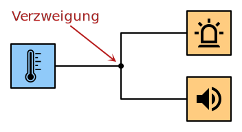

# 3.1 Schaltung
---

Im folgenden betrachten wir digitale **Schaltungen**. Eine digitale Schaltung hat mindestens einen Eingang sowie einen oder mehrere Ausgänge. Da die Schaltung digital ist, sind bei jedem Eingang und Ausgang immer nur zwei Werte möglich: Null oder Eins.

Die obenstehende Schaltung hat zwei Eingänge (A und B) sowie zwei Ausgänge (X und Y).

## Wahrheitstabelle

Jede digitale Schaltung kann durch eine **Wahrheitstabelle** beschrieben werden. In der Wahrheitstabelle werden für alle möglichen Eingabekombinationen die entsprechenden Ausgabewerte festgehalten.

Für eine Schaltung mit zwei Eingängen gibt es insgesamt vier Möglichkeiten. Sowohl Eingang A als auch Eingang B können die Werte :0: oder :1: annehmen.

Die obenstehende Schaltung kann beispielsweise mit folgender Tabelle beschrieben werden:

|  A  |  B  |  X  |  Y  |
|:---:|:---:|:---:|:---:|
|  0  |  0  |  0  |  0  |
|  0  |  1  |  1  |  0  |
|  1  |  0  |  0  |  1  |
|  1  |  1  |  1  |  1  |

::: exercise Aufgabe 1
Wie könnte eine Schaltung mit dieser Wahrheitstabelle wohl aussehen?
:::

## Eingabe

Um einfache Schaltungen erstellen zu können, benötigen wir ein paar einfachen Ein- und Ausgabemöglichkeiten.  Wir haben folgende Eingabemöglichkeiten für unsere Schaltungen:

|                               |                                                                        |
| -----------------------------:|:---------------------------------------------------------------------- |
|       | Druckknopf, liefert Eingabe :1:, wenn er gedrückt wird.                |
|       | Schalter, kann ein- oder ausgeschaltet werden.                         |
|  | Temperatursensor, liefert als Eingabe :1:, wenn es warm ist.           |
|        | Lichtsensor, liefert als Eingabe :1:, wenn es hell ist.                |
|     | Feuchtigkeitssensor, liefert als Eingabe :1:, wenn es feucht ist.      |
|     | Bewegungssensor, liefert als Eingabe :1:, wenn Bewegung entdeckt wird. |
|   | Mikrofon, liefert als Eingabe :1:, wenn ein Geräusch entdeckt wird.    |

Für die Ausgabe stehen folgende Geräte zu Verfügung:

|                          |                                    |
| ------------------------:|:---------------------------------- |
|    | Licht, brennt bei Ausgabe :1:      |
|    | Lautsprecher, tönt bei Ausgabe :1: |
|  | Heizung, heizt bei Ausgabe :1:     |
|    | Motor, läuft bei Ausgabe :1:       |

## Direkte Verbindung

Die einfachste Schaltung ist die direkte Verbindung zwischen Ein- und Ausgabe.

::: example Beispiel: Türklingel

Es klingelt, wenn die Taste gedrückt wird.

:::

## Verzweigung

Eine Leitung kann auf verzweigt werden. Die Verzweigung wird durch einen kleinen ausgefüllten Kreis markiert.

::: example Beispiel: Feueralarm

Wenn es brennt (zu hohe Temperatur), so soll ein Warnlicht angeschaltet werden und ein akustisches Signal ertönen.

:::
