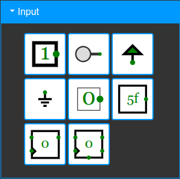
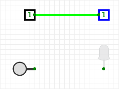
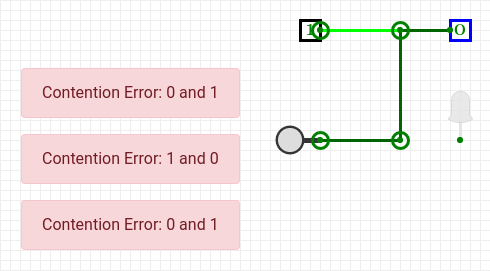

# Inverter
---

Ein Inverter ist eine Schaltung, bei welcher der Ausgang Y den Wert 1 (hohe Spannung) hat, wenn der Eingang den Wert 0 (tiefe Spannung) hat und umgekehrt.

| A   |   Y |
|:--- | ---:|
| 0   |   1 |
| 1   |   0 |

In Schaltplänen wird ein Inverter mit folgendem Symbol dargestellt:

## Beispiele

### Kühlschrankbeleuchtung

Das Licht im Kühlschrank geht an, sobald die Türe **nicht** mehr auf den Knopf drückt.

### Heizung

Die Heizung soll einschalten, wenn es **nicht** warm ist.

## CircuitVerse

Wir arbeiten in diesem Kapitel zu den Logikgattern mit der Online-Plattform [CircuitVerse](https://circuitverse.org/). Dort können Schaltungen einfach geplant werden. Zudem kann über Eingabeelemente gezielt Strom auf die Leitungen gegeben und die gezeichnete Schaltung mittels Ausgabeelementen überprüft werden.

### Eingabeelemente

Es stehen etliche Eingabeelemente zur Auswahl, wir verwenden allerdings nur die beiden ersten («Input» und «Button»). Die Elemente werden links ausgewählt und anschliessend im Arbeitsbereich wie gewünscht platziert.

Beim Element **Input** kann durch Mausklick zwischen einer **1** (Strom) und einer **0** (kein Strom) hin- und hergewechselt werden.

Das Element **Button** ist stets ausgeschaltet, ausser während der Zeit, in der mit der Maus auf die Taste gedrückt wird.

### Ausgabeelemente

Auch hier stehen etliche Elemente zur Verfügung. Wir verwenden ausschliesslich die beiden oben links («Output») und oben rechts («DigitalLed»). Hier ist zu sehen, ob an diesem Ausgang Strom anliegt oder nicht.

Das Element **Output** zeigt mit einer **1** oder einer **0** an, ob Strom fliesst oder nicht.

Die **DigitalLed** zeigt durch Leuchten an, sobald Strom fliesst.

## Elemente verbinden

An sämtlichen Elementen ist mit grünen Punkten markiert, wo Verbindungen angeschlossen werden können. Um Komponenten zu verbinden, klickst du auf einen Punkt, hältst die Maustaste gedrückt und ziehst die Leitung bis zum anderen Punkt.

Es ist erlaubt, mehrere Ausgabeelemente zu verbinden:

Das Verbinden mehrerer Eingänge führt allerdings zu Fehlern – schliesslich ist dann unklar, was gelten soll, wenn verschiedene Eingabewerte auf derselben Leitung anliegen:

### Logikgatter

Im nächsten Bereich befinden sich alle benötigten Logikgatter. Diese in den folgenden Abschnitten vorgestellt.

::: exercise Aufgabe
1. Benutzerkonto erstellen bei [CircuitVerse](https://circuitverse.org/users/sign_up), damit die eigenen Schaltungen abgespeichert werden können. Bitte den richtigen Namen und die Schul-E-Mail-Adresse verwenden.
2. Zum [Simulator](https://circuitverse.org/simulator) wechseln.
3. Platziere die beiden ersten Eingabeelemente **Input** und **Button** untereinander und lege rechts davon die beiden Ausgabeelemente **Output** und **DigitalLed** ab. Verbinde jeweils ein Ein- und Ausgabeelement und teste Ein- und Ausgabe.
4. Nun probiere den **Inverter** aus. Baue ihn ein und teste mit verschiedenen Inputs.
:::
