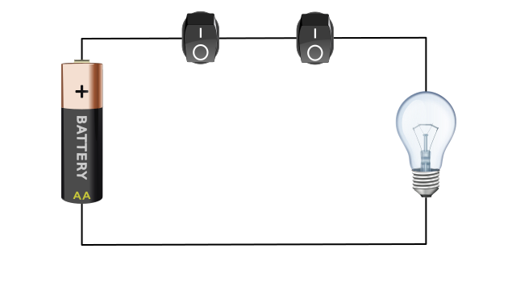

# AND-Gatter
---

Ein AND-Gatter ist eine digitale Schaltung, welche zwei Eingänge und einen Ausgang hat. Der Ausgang Y hat nur dann den Wert 1, wenn Eingange A **und** Eingang B den Wert 1 haben.

## Wahrheitstabelle

| A   | B   |   Y |
|:--- |:--- | ---:|
| 0   | 0   |   0 |
| 0   | 1   |   0 |
| 1   | 0   |   0 |
| 1   | 1   |   1 |

In Schaltplänen wird ein AND-Gatter mit folgendem Symbol dargestellt:

## Interaktive Schaltung

<VueCircuit id="and-gatter" height="200"/>

## Beispiel Lichtschalter

## Beispiele
