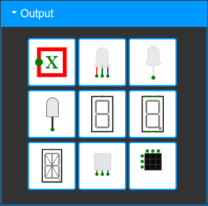

# 3.2 CircuitVerse
---

Wir arbeiten in diesem Kapitel zu den Logikgattern mit der Online-Plattform [CircuitVerse](https://circuitverse.org/). Dort können Schaltungen einfach geplant werden. Über diverse Eingabeelemente kann gesteuert werden, ob an den Eingängen eine :1: oder eine :0: anliegt. Mit verschiedenen Ausgabeelementen kann die gezeichnete Schaltung überprüft werden.

* [:link: CircuitVerse](https://circuitverse.org/)

## Eingabeelemente

Es stehen etliche Eingabeelemente zur Auswahl, wir verwenden allerdings nur die beiden ersten (_Input_ und _Button_). Die Elemente werden links in der Spalte der _Circuit Elements_ im Bereich _Input_ ausgewählt und anschliessend im Arbeitsbereich wie gewünscht platziert.

Beim Element _Input_ (oben links) kann durch Mausklick zwischen einer **1** und einer **0** hin- und hergewechselt werden.

Das Element _Button_ (oberste Zeile Mitte) ist stets ausgeschaltet (also :0:), ausser während der Zeit, in der mit der Maus auf den Druckknopf gedrückt wird.

## Ausgabeelemente

Im Bereich _Output_ hier stehen wiederum etliche Elemente zur Verfügung. Wir verwenden ausschliesslich die beiden oben links (_Output_) und oben rechts (_DigitalLed_).

Das Element _Output_ zeigt als Ausgabe eine **1** oder eine **0** an, während die _DigitalLed_ im Zustand :1: leuchtet.

## Elemente verbinden

An sämtlichen Elementen ist mit grünen Punkten markiert, wo Verbindungen angeschlossen werden können. Um Komponenten zu verbinden, klickst du auf einen Punkt, hältst die Maustaste gedrückt und ziehst die Leitung bis zum anderen Punkt.

Es ist erlaubt, mehrere Ausgabeelemente zu verbinden:

Das Verbinden mehrerer Eingänge führt allerdings zu Fehlern – schliesslich ist dann unklar, was gelten soll, wenn verschiedene Eingabewerte auf derselben Leitung anliegen:

## Elemente benennen

Ist ein Ein- oder Ausgabeelement auf dem Schaltplan aktiv (angeklickt), so können in der linken Spalte ganz unten unter _Properties_ gewisse Einstellungen des Elementes verändert werden. Für uns sind nur _Label_ und _Label Direction_ interessant. So können Ein- oder Ausgabeelemente angeschrieben und diese Beschriftungen sinnvoll platziert werden.

## Logikgatter

Im nächsten Bereich _Gates_ befinden sich alle benötigten Logikgatter. Diese werden in den folgenden Abschnitten vorgestellt.

::: exercise Aufgaben
1. Erstelle ein Benutzerkonto bei [CircuitVerse](https://circuitverse.org/users/sign_up), damit du die eigenen Schaltungen abspeichern kannst (bitte den richtigen Namen und die Schul-E-Mail-Adresse verwenden).
2. Wechsle zum [Simulator](https://circuitverse.org/simulator).
3. Platziere die beiden ersten Eingabeelemente **Input** und **Button** untereinander und lege rechts davon die beiden Ausgabeelemente **Output** und **DigitalLed** ab. Verbinde jeweils ein Eingabeelement mit einem Ausgabeelement und teste die Ein- und Ausgabe durch umschalten der Eingabewerte.
4. Beschrifte sämtliche Ein- und Ausgabeelemente und wähle einen sinnvollen Platz für die Beschriftungen.
5. Speichere für die Aufgabe ab (dies wird in Zukunft nicht mehr erwähnt, sondern versteht sich von selbst).
:::
