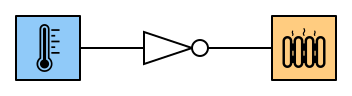

# Inverter
---

Ein Inverter ist eine Schaltung, bei welcher der Ausgang Y den Wert 1 (hohe Spannung) hat, wenn der Eingang den Wert 0 (tiefe Spannung) hat und umgekehrt.

| A   |   Y |
|:--- | ---:|
| 0   |   1 |
| 1   |   0 |

In Schaltungen wird das folgende Symbol für einen Inverter verwendet:

## Beispiele

### Kühlschrankbeleuchtung

Das Licht im Kühlschrank geht an, sobald die Türe **nicht** mehr auf den Knopf drückt.

### Heizung

Die Heizung soll einschalten, wenn es **nicht** warm ist.

::: exercise Aufgabe

Überlege dir, ob bei folgenden Schaltungen ein Inverter eingesetzt werden muss oder nicht:

1. **Einbruchalarm:** Ein akustischer Alarm soll ertönen, wenn eine Bewegung entdeckt wird.

2. **Bewässerungsanlage:** Wenn die Erde in der Blumenkiste trocken ist, soll eine Wasserpumpe (Motor) eingeschaltet werden. Wenn die Erde feucht ist, soll der Motor ausgeschaltet werden.

:::

::: exercise Aufgabe CircuitVerse
1. Erstelle in CircuitVerse die Schaltung für die Kühlschrankbeleuchtung mit einem _Button_ als Eingabe und einem _DigitalLed_ als Ausgabe.
:::
