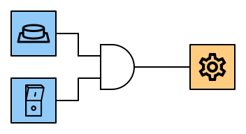
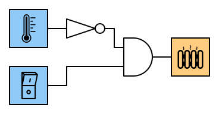
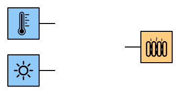
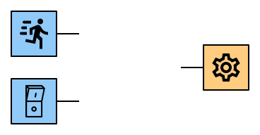
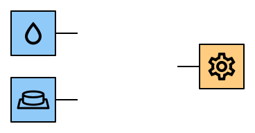
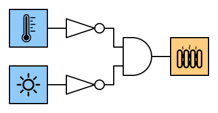
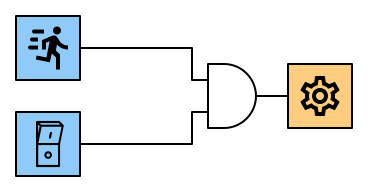
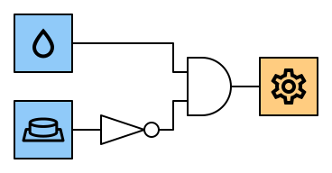

# AND-Gatter
---

Ein AND-Gatter ist eine digitale Schaltung, welche zwei Eingänge und einen Ausgang hat. Der Ausgang Y hat nur dann den Wert 1, wenn Eingange A **und** Eingang B den Wert 1 haben.

## Wahrheitstabelle

| A   | B   |   Y |
|:--- |:--- | ---:|
| 0   | 0   |   0 |
| 0   | 1   |   0 |
| 1   | 0   |   0 |
| 1   | 1   |   1 |

In Schaltplänen wird ein AND-Gatter mit folgendem Symbol dargestellt:

## Interaktive Schaltung

<VueCircuit id="and-gatter" height="200"/>

## Beispiele

### Kaffeemühle

Aus Sicherheitsgründen mahlt die Kaffeemühle nur, wenn gleichzeitig der Deckel geschlossen ist und der Stromschalter eingeschaltet ist.

### Heizung mit Hauptschalter

Natürlich können auch mehrere Gatter zu einer Schaltung kombiniert werden. Im folgenden Beispiel soll eine Heizung nur eingeschaltet werden, wenn es kalt ist und der Hauptschalter eingeschaltet ist:

::: exercise Aufgaben

Entwirf je eine Schaltung für die folgenden Szenarien. Gehe für jedes Szenario so vor:

- Erstelle eine Wahrheitstabelle für das Szenario.
- Entwirf die Schaltung in CircuitVerse.
- Überprüfe, ob die Schaltung mit der Wahrheitstabelle übereinstimmt.

1. **Heizung:** Eine Heizung soll nur tagsüber eingeschaltet werden, wenn es kalt ist.

2. **Automatische Tür:** Die Tür wird durch einen Motor betrieben. Sie soll nur aufgehen, wenn eine Bewegung entdeckt wird und der Hauptschalter eingeschaltet ist.

3. **Dachfenster:** Ein Dachfenster soll durch einen Motor automatisch geschlossen werden, sobald es regenet. Wenn das Fenster zu ist, drückt es einen Knopf, der bewirkt, dass der Motor ausschaltet wird.

***

**Heizung**

**Automatische Tür**

**Dachfenster**

:::

::: extra Zusatzaufgabe

Wie viele unterschiedliche digitale Schaltungen mit zwei Eingängen und einem Ausgang sind möglich?
:::
