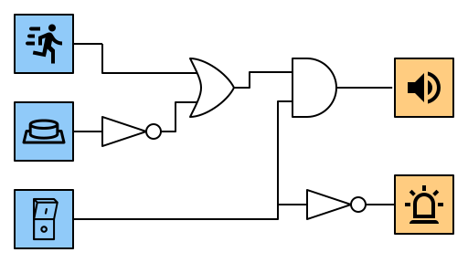

# 3.5 OR-Gatter
---

Bei einem OR-Gatter hat der Ausgang Y dann den Wert :1:, wenn Eingang A **oder** Eingang B (oder beide) den Wert :1: haben.

|  A  |  B  |  Y  |
|:---:|:---:|:---:|
|  0  |  0  |  0  |
|  0  |  1  |  1  |
|  1  |  0  |  1  |
|  1  |  1  |  1  |

In Schaltplänen wird ein OR-Gatter mit folgendem Symbol dargestellt:

## Interaktive Schaltung

<VueCircuit id="rothe-or-gate"/>

## Beispiele

### Türöffner

In einem Haus soll die Eingangstüre aus der Wohnung im ersten Stock sowie aus der Wohnung im zweiten Stock durch einen Knopfdruck geöffnet werden können.

### Einbruchsalarm

Ein Einbruchsalarm gibt ein akustisches Signal, wenn eine Bewegung entdeckt wurde oder wenn die Türe geöffnet wurde. Dies wird wie beim Kühlschrank durch einen Druckknopf erkannt, welcher durch die geschlossene Türe gedrückt wird.

::: exercise Aufgaben

Entwirf je eine Schaltung für die folgenden Szenarien. Du kannst **Inverter**, **AND-Gatter** und **OR-Gatter** verwenden. Gehe für jedes Szenario so vor:

- Erstelle eine Wahrheitstabelle für das Szenario.
- Entwirf die Schaltung in CircuitVerse inklusive Beschriftung.
- Überprüfe, ob die Schaltung mit der Wahrheitstabelle übereinstimmt.

1. **Autoinnenbeleuchtung:** Die Innenbeleuchtung in einem Auto soll eingeschaltet werden, wenn die linke oder die rechte Türe geöffnet wird.

    

2. **Notruf Spitalbett:** In einem Spital soll ein Alarm ertönen, wenn ein Patient auf den Rufknopf drückt oder wenn seine Körpertemperatur zu hoch wird.

    

3. **Einbruchsalarm:** Der Einbruchsalarm aus dem Beispiel oben soll zusätzlich einen Hauptschalter erhalten. Der Alarm wird nur ausgelöst, wenn die Alarmanlage eingeschaltet ist. Wenn die Alarmanlage ausgeschaltet ist, soll als Hinweis ein Lämpchen brennen.

    

***

**Autoinnenbeleuchtung**

**Notruf Spitalbett**

**Einbruchsalarm**

:::
