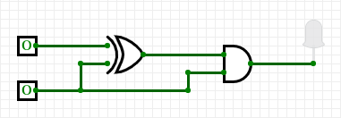

# 3.6 XOR-Gatter
---

Ein XOR-Gatter (engl. *exclusive or*) hat der Ausgang Y dann den Wert :1:, wenn Eingang A **oder** Eingang B **aber** nicht beide den Wert :1: haben.

|  A  |  B  |  Y  |
|:---:|:---:|:---:|
|  0  |  0  |  0  |
|  0  |  1  |  1  |
|  1  |  0  |  1  |
|  1  |  1  |  0  |

In Schaltplänen wird ein XOR-Gatter mit folgendem Symbol dargestellt:

## Interaktive Schaltung

<VueCircuit id="rothe-xor-gate"/>

::: exercise Aufgaben

Entwirf je eine Schaltung für die folgenden Szenarien. Du kannst **OR-Gatter** oder **XOR-Gatter** sowie **Inverter** verwenden. Gehe für jedes Szenario so vor:

- Erstelle eine Wahrheitstabelle für das Szenario.
- Entwirf die Schaltung in CircuitVerse inklusive Beschriftung.
- Überprüfe, ob die Schaltung mit der Wahrheitstabelle übereinstimmt.

1. **Schwimmbadabdeckung**: Ein Schwimmbecken verfügt auf einer Seite über eine aufgerollte Abdeckung. Diese wird beim Schliessen von einem Motor mit zwei Seilen über das Schwimmbecken gezogen. Beim Öffnen wird die Abdeckung von einem anderen Motor aufgerollt. Jeder Motor wird mit einem eigenen Druckknopf in Gang gebracht. Es soll sichergestellt werden, dass nie beide Motoren gleichzeitig laufen und dadurch die Abdeckung in Stücke reissen.

2. **Anna und Bert**: Anna und Bert arbeiten in einem dunklen Archiv im Keller. Immer wenn jemand von ihnen im Archiv ist, soll Licht brennen. Sie hören gerne Musik – allerdings nicht, wenn beide arbeiten, dann haben sie stets viel zu besprechen. Anna und Bert gegen an, ob sie im Büro sind, indem sie je einen eigenen Schalter betätigen.
:::

::: exercise Aufgaben
Analysiere die folgende Schaltung, indem du eine Wahrheitstabelle erstellst. Kann man die Schaltung vereinfachen? Wenn ja, wie?

1. 
