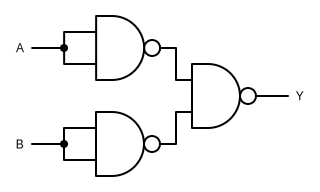

# 3.7 NAND-Gatter
---

Ein NAND-Gatter (engl. *not and*) hat der Ausgang Y dann den Wert :0:, wenn Eingange A **und** Eingang B den Wert :1: haben.

|  A  |  B  |  Y  |
|:---:|:---:|:---:|
|  0  |  0  |  1  |
|  0  |  1  |  1  |
|  1  |  0  |  1  |
|  1  |  1  |  0  |

In Schaltplänen wird ein NAND-Gatter mit folgendem Symbol dargestellt:

## Interaktive Schaltung

<VueCircuit id="rothe-nand-gate"/>

Ein NAND-Gatter kann aus einem AND-Gatter, gefolgt von einem Inverter zusammengesetzt werden:

## Universalgatter

Das NAND-Gatter hat eine besondere Bedeutung. Dank dem Mathematiker George Boole kann bewiesen werden, dass **jede** logische Schaltung ausschliesslich aus NAND-Gatter aufgebaut werden kann. Ausserdem sind NAND-Gatter physikalisch relativ einfach aufzubauen. Deshalb bilden NAND-Gatter den Grundbaustein für heutige Mikrochips.

::: exercise Aufgaben

1. Baue eine Inverter-Schaltung ausschliesslich aus NAND-Gattern auf.

2. :extra: Baue eine AND-Schaltung ausschliesslich aus NAND-Gattern auf.

3. :extra: Baue eine OR-Schaltung  ausschliesslich aus NAND-Gattern auf.

4. :extra: Baue eine XOR-Schaltung ausschliesslich aus NAND-Gattern auf.

***

**Inverter aus NAND-Gattern**

**AND-Schaltung aus NAND-Gattern**

**OR-Schaltung aus NAND-Gattern**

**XOR-Schaltung aus NAND-Gattern**

:::
