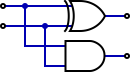

# Addierer
---

## XOR-Gatter

Ein XOR-Gatter (engl. *exclusive or*) hat der Ausgang Y dann den Wert 1 (hohe Spannung), wenn Eingang A **oder** Eingang B **aber** nicht beide den Wert 1 (hohe Spannung) haben.

| A   | B   |   Y |
|:--- |:--- | ---:|
| 0   | 0   |   0 |
| 0   | 1   |   1 |
| 1   | 0   |   1 |
| 1   | 1   |   0 |

In Schaltplänen wird ein XOR-Gatter mit folgendem Symbol dargestellt:

## Halbaddierer

Wie könnte man die Addition zweier einstelliger Zahlen im Binärsystem als Schaltung konstruieren?

$$\begin{aligned}
0 + 0 &= 00_2\\
0 + 1 &= 01_2\\
1 + 0 &= 01_2\\
1 + 1 &= 10_2
\end{aligned}$$

Die entsprechende Schaltung benötigt zwei Eingänge und zwei Ausgänge. Die beiden Eingänge werden für die zwei Summanden verwendet. Die Ausgänge für die Einer- und Zweierstelle des Resultats. Die gesuchte Schaltung muss also folgende Wertetabelle haben:

| A   | B   | Zweier | Einer |
|:--- |:--- | ------:| -----:|
| 0   | 0   |      0 |     0 |
| 0   | 1   |      0 |     1 |
| 1   | 0   |      0 |     1 |
| 1   | 1   |      1 |     0 |

