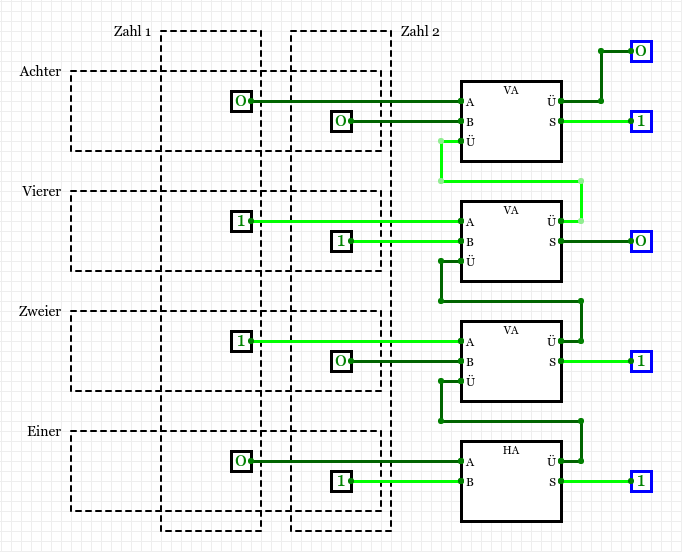

# 3.8 Addierer
---

## Binäre Addition

<VueVideo id="x7ka0QwKciA"/>

## Halbaddierer

Wie könnte man die Addition zweier einstelliger Zahlen im Binärsystem als Schaltung konstruieren?

$$\begin{aligned}
0 + 0 &= 00_2\\
0 + 1 &= 01_2\\
1 + 0 &= 01_2\\
1 + 1 &= 10_2
\end{aligned}$$

Die entsprechende Schaltung benötigt zwei Eingänge und zwei Ausgänge. Die beiden Eingänge werden für die zwei Summanden verwendet. Die Ausgänge für die Einer- und Zweierstelle des Resultats. Die gesuchte Schaltung muss also folgende Wertetabelle haben:

| A   | B   | Zweier | Einer |
|:--- |:--- | ------:| -----:|
| 0   | 0   |      0 |     0 |
| 0   | 1   |      0 |     1 |
| 1   | 0   |      0 |     1 |
| 1   | 1   |      1 |     0 |

Der Wert der Einerstelle kann durch ein XOR-Gatter berechnet werden, der Wert der Zweierstelle durch ein AND-Gatter. Die Schaltung sieht somit so aus:

<VueCircuit id="rothe-half-adder"/>

::: exercise Aufgabe Halbaddierer
1. Erstelle ein neues Projekt in CircuitVerse und nenne es Addierer.
2. Baue den Halbaddierer in CircuitVerse nach und probiere aus, ob die Addition von zwei Bits (inklusive Übertrag) korrekt funktioniert.
3. Benenne die Eingänge mit «A» und «B», sowie die Ausgänge korrekt mit «S» (für «Summe») und «Ü» (für «Übertrag»).
4. Benenne die Schaltung (sprich die Registerkarte) «HA» (für Halbaddierer).
:::

## Volladdierer

Ein Halbaddierer addiert also 2 separate Bit und sorgt dafür, dass neben dem Resultat auch der Übertrag für die nächste Stelle mittels zweitem Ausgang bereitsteht.

Allerdings berücksichtigt ein Halbaddierer nur die beiden zu addierenden Bits am Eingang, ein allfällig zu berücksichtigender Übertrag bleibt unbeachtet.

::: exercise Aufgabe Volladdierer
Versuche, die Halbaddierer-Schaltung so auszubauen, dass drei Eingänge zur Verfügung stehen, damit auch ein vorhandener Übertrag bei der Addition berücksichtigt wird:

1. Erstelle dazu zuerst die Wahrheitstabelle und überlege dir anschliessend, wie die Schaltung angepasst werden muss.
2. Baue in CircuitVerse eine neue Schaltung (in einer neuen Registerkarte) im Addierer-Projekt und nenne sie «VA» (für Volladdierer).
3. Verwende zum Erstellen des Volladdierers als Baustein die Schaltung «HA», die du bereits hast als Baustein, indem du im Menü _Circuit_ auf _Insert SubCircuit_ klickst und den Halbaddierer einfügst. So wird die Schaltung übersichtlicher.
***
**Hinweis**: Du kannst zwei Halbaddierer (plus ein OR-Gatter) zu einem Volladdierer kombinieren.
***
| A   | B   | Ü   | Zweier | Einer |
|:--- |:--- |:--- | ------:| -----:|
| 0   | 0   | 0   |      0 |     0 |
| 0   | 0   | 1   |      0 |     1 |
| 0   | 1   | 0   |      0 |     1 |
| 0   | 1   | 1   |      1 |     0 |
| 1   | 0   | 0   |      0 |     1 |
| 1   | 0   | 1   |      1 |     0 |
| 1   | 1   | 0   |      1 |     0 |
| 1   | 1   | 1   |      1 |     1 |

:::

## 4-Bit-Addierer
Wir haben mit dem Volladdierer einen Baustein, der zwei 1-Bit-Zahlen addieren kann – inklusive korrekte Behandlung des Übertrags. Nun wollen wir aus mehreren solchen Bausteinen einen kompletten Addierer bauen, der mehrere Stellen gleichzeitig addieren kann.

::: exercise Zusatzaufgabe 4-Bit-Addierer
Versuche, die Halbaddierer-Schaltung so auszubauen, dass drei Eingänge zur Verfügung stehen, damit auch ein vorhandener Übertrag bei der Addition berücksichtigt wird:

1. Baue in CircuitVerse eine neue Schaltung (d.h. eine neue Registerkarte) im Addierer-Projekt und nenne sie «4-Bit-Addierer».
2. Verwende zum Zeichnen der Schaltung einen Halbaddierer-Baustein «HA» sowie drei Volladdierer-Bausteine «VA».
***
**Hinweis**: Zum Addieren der Einer-Stelle braucht es nur einen Halbaddierer, da dort noch kein Übertrag vorhanden sein kann.
***

:::
