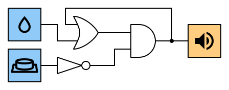

# :extra: 3.9 Speicher
---

Die bisherigen Schaltungen für den Einbruchsalarm haben einen grossen Nachteil: sobald der Bewegungsmelder keine Bewegung mehr entdeckt, wird der Alarm abgestellt.

Ein guter Einbruchsalarm sollte aber nicht mehr abschalten. Die Schaltung sollte die Information, dass eine Bewegung entdeckt wurde, speichern können.

Mit Hilfe eines OR-Gatter kann dies realisiert werden. Dazu wird das Ausgangssignal des OR-Gatters wieder als Eingang verwendet. Das führt dazu, dass das OR-Gatter immer den Wert :1: liefern wird, sobald es einmal diesen Wert im Ausgang angenommen hat.

## Interaktive Schaltung

In dieser interaktiven Schaltung kannst du die Rückkopplung testen:

<VueCircuit id="rothe-feedback"/>

::: info
#### Rückkopplung
Wenn der Ausgang einer Schaltung wieder als Eingang verwendet wird, nennt man dies **Rückkopplung**.

Schaltungen mit Rückkopplung ermöglichen das **Speichern** von Daten sowie die Konstruktion von programmierbaren Schaltungen. Die Rückkopplung ist also ein zentrales Konzept für den Bau von Computern.
:::

## Rückkopplung mit Reset

Natürlich will man die Alarmanlage auch wieder Abschalten können. Dazu kann in der Rückkopplungsschleife ein Reset-Knopf eingebaut werden:

<VueCircuit id="rothe-feedback-with-reset"/>

::: exercise Aufgaben
1. Da manchmal Wasser in deinen Keller eindringt, möchtest du wissen, ob es seit der letzten Kontrolle besonders stark geregnet hat. Ein Feuchtigkeitssensor alleine reicht nicht. Baue in **CircuitVerse** eine entsprechend beschriftete Schaltung mit einer Rückkopplung, die speichert, wenn der Niederschlag zu stark war.
2. Baue einen Druckknopf ein, mit dem du die Anzeige wieder zurücksetzen kannst.

    

***

:::

## Speicher

Die Schaltung «Rückkopplung mit Reset» wird in der Informatik als SR-Flip-Flop bezeichnet.
Sie speichert den Wert 1, falls der Eingang «Set» aktiviert ist und speichert den Wert 0, falls der Eingang «Reset» aktiviert ist.

Diese Schaltung bildet die Grundlage für den Bau von Speicher (RAM). Um ein Bit zu speichern, wollen wir eine Schaltung, welche die folgenden zwei Eingänge hat:

- Daten: gibt an, welcher Wert gespeichert werden soll.
- Speichern: gibt durch ein 1 an, ob nun der Datenwert abgespeichert werden soll.

<VueCircuit id="rothe-d-flip-flop"/>
