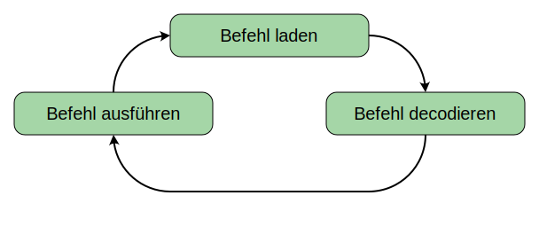

# 4.4 Von-Neumann-Zyklus
---

Der Prozessor führt immer wieder den gleichen zyklischen Ablauf aus. Dieser Ablauf wird auch **Von-Neumann-Zyklus** genannt und besteht aus folgenden vier Schritten:

## 1. Befehlsadresse setzen

Die Speicheradresse, an welcher der nächste Befehl steht, wird vom Befehlszähler an das Speicherwerk übermittelt.

## 2. Befehl abrufen

Der Befehl wird aus dem Speicher über den Datenbus in das Dekodierwerk übertragen.

## 3. Programmzähler erhöhen

Damit im nächsten Durchlauf der nächste Befehl geladen wird, muss der Programmzähler um eins erhöht werden.

## 4. Datenadresse setzen

Manche Befehle verwenden Daten aus dem Speicher. Bevor der Befehl ausgeführt wird muss daher dem Speicherwerk die Adresse der Speicherzelle mitgeteilt werden.

## 5. Befehl decodieren

Das Dekodierwerk setzt den Befehl in Steuersignale an die verschiedenen Komponenten um.

## 6. Befehl ausführen

Ein Wert wird aus dem Speicher geladen oder in den Speicher geschrieben. Das Rechenwerk führt die arithmetische Operation aus.
