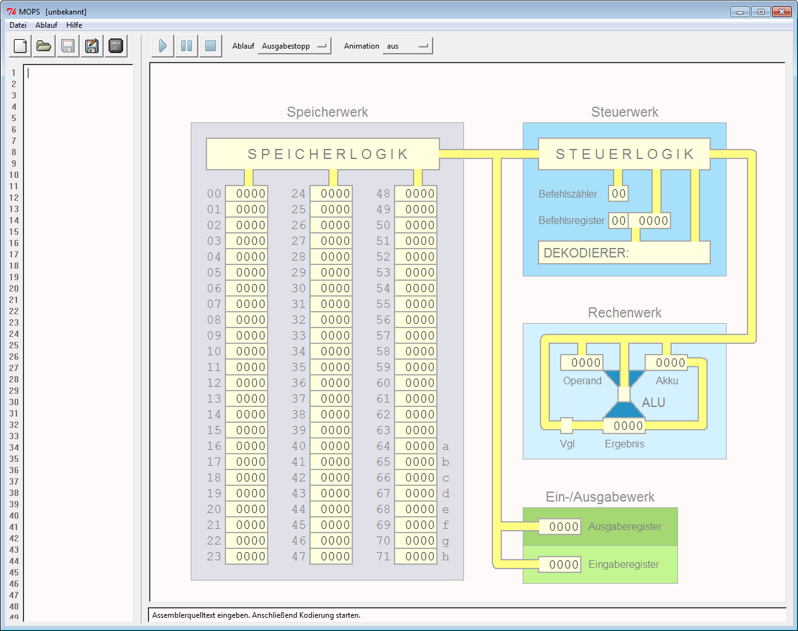

# Modellrechner MOPS
---

Der Modellrechner mit Pseudoassembler (MOPS) ist ein Programm, welches einen einfachen Computer auf den Stufen *Assemblersprache* und *Befehlssatz* simuliert.



## Programmierung

MOPS wird mit einer Assemblersprache programmiert. Eine Assemblersprache ist eine Abstraktion von Maschinencode. Anstelle von Bitmustern werden Abkürzungen in Textform für die Darstellung von Befehlen verwendet. Für die Bezeichnung von Speicheradressen können Variablennamen verwendet werden.

Die Assemblersprache von MOPS hat folgende Regeln:

- Jede Zeile enthält einen Befehl, welcher ganz links beginnen muss.
- Die meisten Befehle haben einen *Operanden*, der vom Befehl mit einem Leerzeichen abgetrennt wird.
- Einem Befehl kann eine Sprungmarke vorangestellt werden: `#gohere: ld a`
- *Kommentare:* Was rechts von einem Strichpunkt steht, wird ignoriert.
- Am Schluss vom Programm muss der Befehl `end` stehen.

Es gibt drei Arten von Operanden:

| Typ        | Kürzel | Beispiel        | Bemerkungen                                                 |
|:---------- |:------ |:--------------- |:----------------------------------------------------------- |
| Wert       | *val*  | `0`, `12`, `25` | ganze Zahl zwischen -9999 und 9999                          |
| Adresse    | *adr*  | `$64`, `d`      | Speicheradresse (`$64` bis `$71`) oder Variable `a` bis `h` |
| Sprungziel | *tar*  | `#12` `#gohere` | Zeilennummer oder Marke, beginnt mit Hashtag                |

Die folgende Tabelle zeigt alle unterstützten Befehle:

| Befehl    | Code | Funktion                                                                      |
|:--------- |:---- |:----------------------------------------------------------------------------- |
| ld *adr*  | 10   | **load:** Lade den Wert an der Adresse adr in den Akku                        |
| ld *val*  | 11   | **load:** Lade den Wert val in den Akku                                       |
| st *adr*  | 12   | **store:** Speichere den Wert des Akku an der Adresse adr                     |
| in *adr*  | 20   | **input:** Schreibe den Wert des Eingaberegisters an die Adresse adr          |
| out *adr* | 22   | **output:** Schreibe den Wert an der Adresse adr ins Ausgaberegister          |
| out *val* | 23   | **output:** Schreibe den Wert val ins Ausgaberegister                         |
| add *adr* | 30   | **add:** Addiere den Wert an der Adresse adr zum Akku                         |
| add *val* | 31   | **add:** Addiere den Wert val zum Akku                                        |
| sub *adr* | 32   | **subtract:** Subtrahiere den Wert an der Adresse adr vom Akku                |
| sub *val* | 33   | **subtract:** Subtrahiere den Wert val vom Akku                               |
| mul *adr* | 34   | **multiply:** Multipliziere den Wert an der Adresse adr mit dem Akku          |
| mul *val* | 35   | **multiply:** Multipliziere den Wert val mit dem Akku                         |
| div *adr* | 36   | **divide:** Dividiere den Akku durch den Wert an der Adresse adr              |
| div *val* | 37   | **divide:** Dividiere den Akku durch den Wert val                             |
| mod *adr* | 38   | **modulo:** Rest bei Division des Akku durch den Wert an der Adresse adr      |
| mod *val* | 39   | **modulo:** Rest bei Division des Akku durch den Wert val                     |
| cmp *adr* | 40   | **compare:** Vergleiche den Akkuinhalt mit dem Wert an der Adresse adr        |
| cmp *val* | 41   | **compare:** Vergleiche den Akkuinhalt mit dem Wert val                       |
| jmp *tar* | 50   | **jump:** Springe zum Zielpunkt tar (Zeilennummer oder Marke)                 |
| jlt *tar* | 52   | **jump if less than:** Springe ..., wenn bei cmp der Akkuinhalt kleiner war   |
| jeq *tar* | 54   | **jump if equal:** Springe ..., wenn bei cmp der Akkuinhalt gleich war        |
| jgt *tar* | 56   | **jump if greater than:** Springe ..., wenn bei cmp der Akkuinhalt größer war |
| end       | 60   | **end:** Beendet ein Programm                                                 |

::: exercise MOPS

1. Schreibe ein MOPS-Programm, das 2 eingegebene Zahlen addiert.
2. Schreibe ein MOPS-Programm, das 3 Zahlen als Input erwartet (a , b und c) und beginnend mit Zahl a bis zur Zahl b in Schritten der Grösse c hoch zählt.
3. Schreibe ein MOPS-Programm, das die Fibonacci-Folge ausgibt. Die beiden Startzahlen soll man eingeben können. Diese sollen auch ausgegeben werden.
4. Schreibe ein MOPS-Programm, das die Fakultät einer eingegebenen Zahl berechnet.
5. Schreibe ein MOPS-Programm, das das Maximum dreier eingegebener Zahlen ausgibt, also die grösste der drei Zahlen.
***

Aufgabe a)

``` text solutions/mops-a.ass
```

Aufgabe b)

``` text solutions/mops-b.ass
```

Aufgabe c)

``` text solutions/mops-c.ass
```

:::

* [:link: MOPS-Webseite](http://www.viktorianer.de/info/mops.html)
* [:download: MOPS-Download (für Windows)](http://www.viktorianer.de/info/material/mops_100_setup.exe)
* [:download: MOPS-Anleitung (PDF)](http://www.viktorianer.de/info/material/mops-1.01.pdf)
