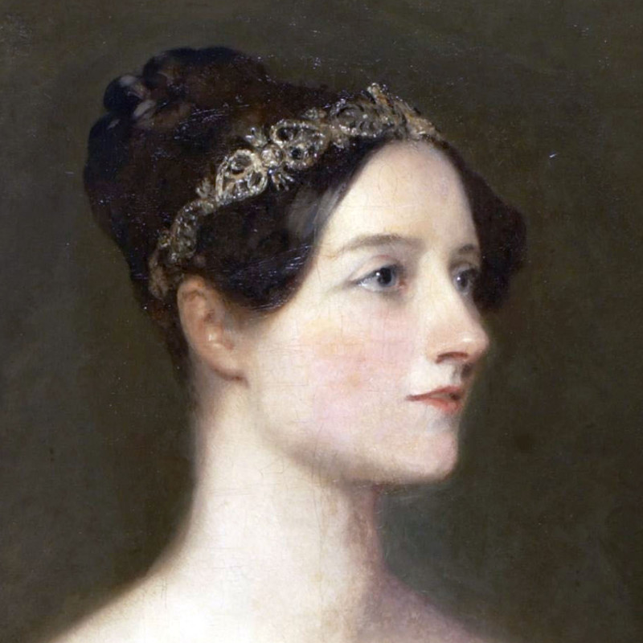
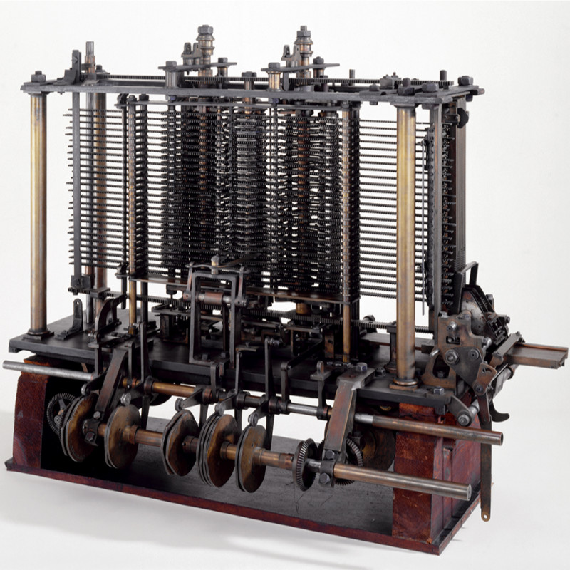
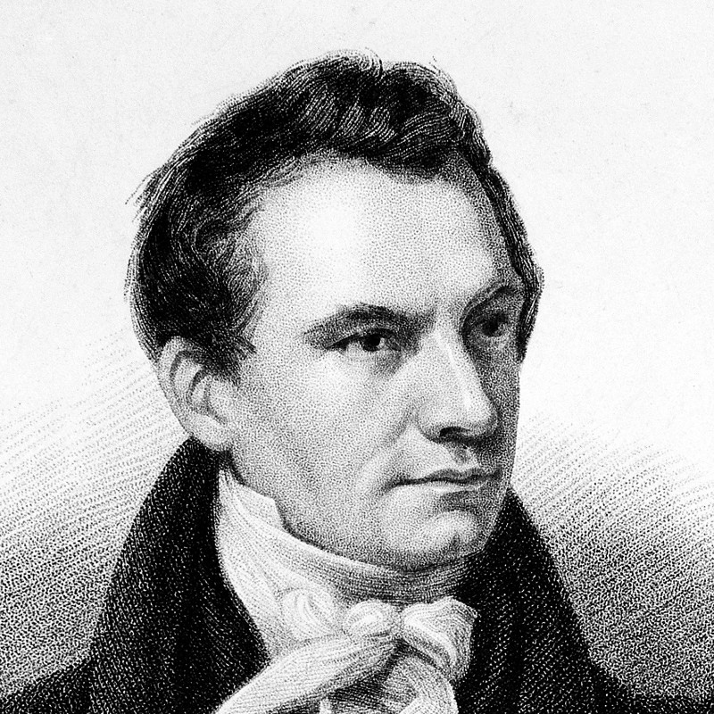

# Analytical Engine
---

Der britische Mathemtaiker Charles Babbage (1791 bis 1871) hat 1837 die Beschreibung der **Analytical Engine** veröffentlicht, einer mechanischen Rechenmaschine. Die Analytical Engine sollte von einer Dampfmaschine angetrieben werden, aus 55'000 Teilen bestehen und 19 Meter lang und drei Meter hoch werden. Die Eingabe von Befehlen und Daten sollte über Lochkarten erfolgen. Die Maschine wurde bis heute nie gebaut, aber es ist anerkannt, dass der Entwurf funktionieren würde.

Die Analytical Engine konnte nicht nur allgemeine mathematische Operationen ausführen, sie konnte auch Zwischenergebnisse speichern und Operationen wiederholt oder nur unter bestimmten Bedingungen ausführen. Sie war somit der erste **Computer**.

::: columns 3

***

***

:::

Augusta Ada Byron King, Countess of Lovelace, bekannt als Ada Lovelace (1815 bis 1852) war eine britische   Mathematikerin. Sie hat die universelle Anwendbarkeit von Computern vorausgesehen.

> [The Analytical Engine] might act upon other things besides number, were objects found whose mutual fundamental relations could be expressed by those of the abstract science of operations, and which should be also susceptible of adaptations to the action of the operating notation and mechanism of the engine… Supposing, for instance, that the fundamental relations of pitched sounds in the science of harmony and of musical composition were susceptible of such expression and adaptations, the engine might compose elaborate and scientific pieces of music of any degree of complexity or extent.

Ada Lovelace veröffentlichte einen umfangreichen Kommentar zur Programmierung der von Babbage entwickelten Maschine. Aufgrund dessen wird sie heute oft als erste Programmierin bezeichnet.
