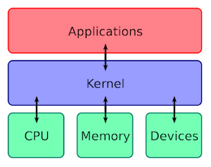

# 5.4.1 GNU/Linux
---

## Was ist Linux resp. GNU/Linux?
**Linux** bezeichnet eigentlich nur den Kernel, auch wenn der Begriff umgangssprachlich häufig als Bezeichnung für das ganze Betriebssystem verwendet wird. Korrekt ist die Bezeichnung **GNU/Linux**. *Linux* steht für den Kernel und *GNU* für die Betriebssystem-Tools.

Die Bezeichnung *GNU* steht für **G**nu’s **N**ot **U**nix. Das GNU-Projekt stellt ein vollständig UNIX-ähnliches Betriebssystem als *freie Software* zur Verfügung – im Gegensatz zum kommerziellen UNIX.

Da sich die Entwicklung eines GNU-Kernels verzögerte, begann der finnische Student *Linus Torvalds* im Sommer 1991 damit, selbst einen Kernel zu den GNU-Tools zu programmieren. Linux ist freie Software, das heisst der gesamte Quelltext steht im Internet offen zur Verfügung und Linux darf modifiziert, kopiert und weitergegeben werden. Heute wird der Linux-Kernel von einem weltweiten Netzwerk von Programmierern unter der Federführung von Linus weiterentwickelt.

::: columns 2

***

:::

## Was ist UNIX?
Unter dem Begriff **UNIX** versteht man eine Familie von ähnlich aufgebauten Betriebssystemen. Entstanden ist UNIX bereits in den 70er Jahren und war von Anfang an als sehr fortschrittliches Betriebssystem mit folgenden Features ausgestattet:

- hierarchisches Dateisystem
- Multitasking (verschiedene Programme werden gleichzeitig ausgeführt)
- mehrere Benutzer können voneinander getrennt auch gleichzeitig arbeiten
- netzwerkfähig

## Was ist der Kernel?
Bei Betriebssystemen unterscheidet man zwischen dem Kern (englisch: *Kernel*) und den restlichen Betriebssystemprogrammen. Der Kern steuert den Zugriff auf die Hardware und dient den Anwendungen als einheitliche Schnittstelle für den Zugriff darauf, während die Betriebssystemprogramme die Benutzerinteraktion ermöglichen, Verwaltungsaufgaben übernehmen und z.B. auch beim Start dafür sorgen, dass alles Nötige in der richtigen Reihenfolge gestartet wird.

