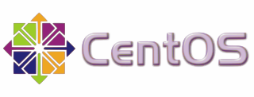

# 5.4.2 Distributionen
---

## Was ist eine Linux-Distribution?
Eine Linux-Distribution ist eine Zusammenstellung von Kernel, GNU-Tools, graphischer Oberfläche(n) und unzähligen weiteren Programmen als Gesamtpaket, das den Benutzern die Installation von Programmen aus der riesigen Menge an verfügbarer Software durch eine Paketverwaltung erleichtert.

Nachfolgend findest du eine kurze Übersicht über bekannte Linux-Distributionen:

::: cards 3
## Debian
Debian[^1] oder Debian GNU/Linux ist eine Linux-Distribution, die von der Debian-Community entwickelt und gepflegt wird. Debian ist eines der ältesten Betriebssysteme, die auf dem Linux-Kernel basieren. Sie gilt als sehr stabile und zuverlässige Distribution. Debian verwendet – wie alle Debian-Derivate – das DEB-Paketformat und die APT-Paketverwaltung.

***

### Ubuntu
Ubuntu[^2] ist eine Linux-Distribution, die von der Firma Canonical Ltd. auf Basis von Debian entwickelt wird. Neue Versionen von Ubuntu werden – im Gegensatz zu Debian – regelmässig alle 6 Monate herausgegeben.

***

### Raspbian
Raspbian[^3] ist eine speziell für den Mini-Computer Raspberry Pi[^4] angepasste Debian-Distribution.

***

### Redhat
Redhat Enterprise Linux[^5] ist eine kommerzielle Linux-Distribution in Enterprise-Bereich. RHEL verwendet den Redhat Package Manager (RPM).

***

### Fedora
Fedora[^6] ist eine Redhat-basierte Community-Distribution. Seit der Abspaltung von Redhat ist Fedora die Basis für das kommerzielle Redhat Enterprise Linux.

***

### CentOS
CentOS[^7] ist eine Redhat-basierte Distribution. Der Name bedeutet **C**ommunity **Ent**erprise **O**perating **S**ystem.

***

### Gentoo
Gentoo[^8] unterscheidet sich deutlich von den oben genannten Distributionen, da die Distribution quellbasiert ist. Dies bedeutet, dass sämtliche Programme erst vor der Installation kompiliert (und nicht bereits in binärer Form als Paket heruntergeladen und installiert) werden. Dies fordert deutlich mehr Wissen – auch bezüglich der Konfiguration der Pakete. Die Paketverwaltung heisst *Portage*.

***

### Linux From Scratch
Linux From Scratch (LFS)[^9], übersetzt "Linux von Grund auf", ist ein Projekt, das noch einen Schritt weitergeht als Gentoo. Es bietet eine Schritt-für-Schritt-Anleitung zur Erstellung eines Linux-Systems, das ganz auf die eigenen Wünsche angepasst ist und von Grund auf aus den Quelltexten kompiliert wird.

:::

[^1]: [Debian](https://debian.org/)
[^2]: [Ubuntu](https://ubuntu.com/)
[^3]: [Raspbian](https://www.raspberrypi.org/downloads/raspbian/)
[^4]: [Raspberry Pi](https://www.raspberrypi.org/)
[^5]: [RHEL](https://redhat.com/en/technologies/linux-platforms/enterprise-linux)
[^6]: [Fedora](https://getfedora.org/)
[^7]: [CentOS](https://centos.org/)
[^8]: [Gentoo](https://www.gentoo.org/)
[^9]: [LFS](http://www.linuxfromscratch.org/)
