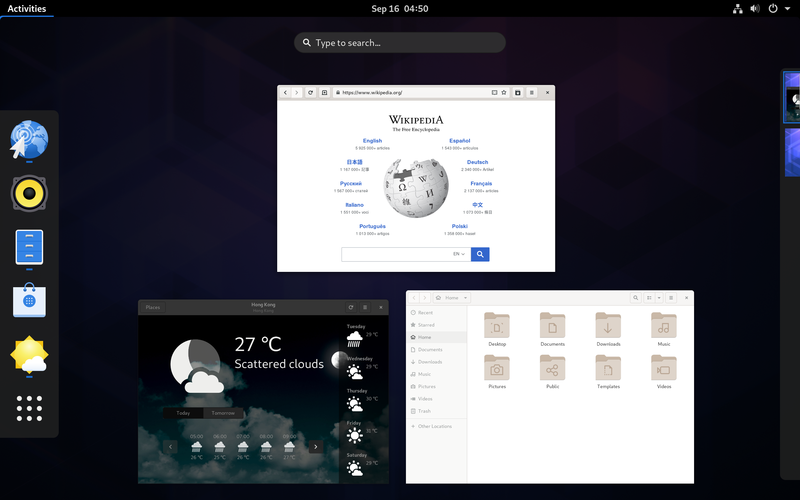
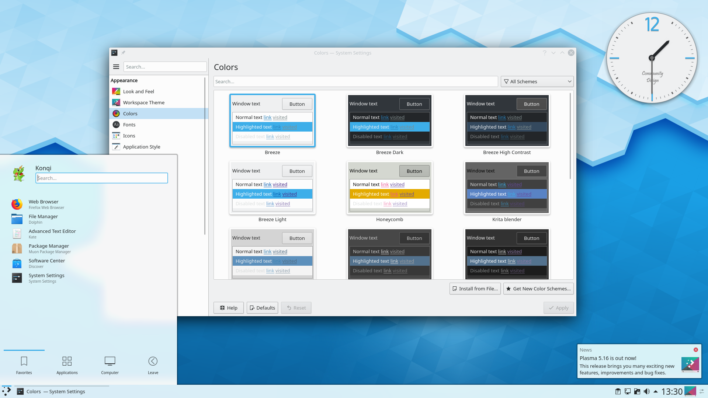
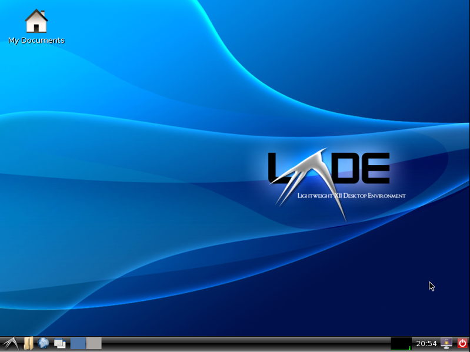
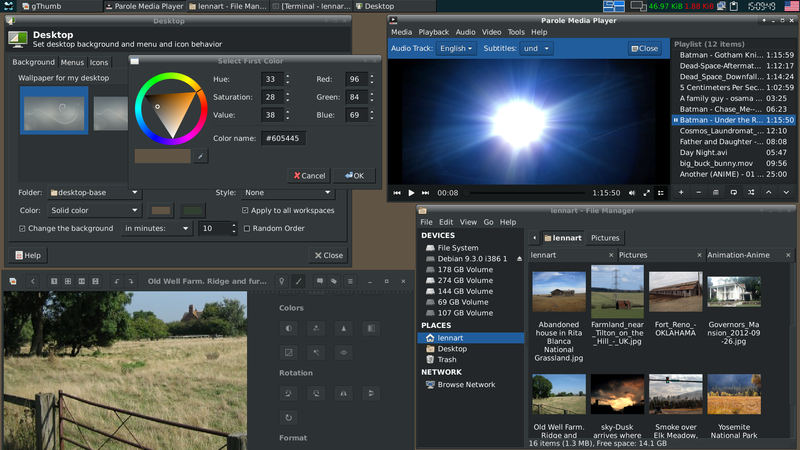

# 5.4.3 Desktopumgebungen
---

Für Linux gibt es nicht nur eine grafische Oberfläche, wie dies bei anderen Betriebssystemen üblich ist. Für Linux existiert eine Vielzahl von sogenannten Desktopumgebungen. Während KDE und GNOME Desktopumgebungen sind, die aktuelle Hardware voraussetzen, gibt es viele Desktopumgebungen (wie z.B. LXDE oder XFCE), die problemlos mit alten, langsamen Geräten funktionieren.

## GNOME
GNOME[^1] 3 ist die Standard-Desktopumgebung in vielen bekannten Linux-Distributionen.

Besonders hervorzuheben ist der *Hot Corner* (also die Sonderfunktion) in der linken oberen Bildschirmecke. Bewegt man die Maus dorthin (oder drückt man die Windows-Taste), wird Folgendes angezeigt:

- links eine Favoritenleiste,
- in der Mitte eine Übersicht sämtlicher offenen Programme,
- oben ein Suchfenster für Programme, Dateien, Einstellungen, etc. und
- rechts eine Übersicht der vorhandenen *Workspaces* (eigene Arbeitsbereiche).

## KDE
KDE[^2] ist ebenfalls in diversen bekannten Linux-Distributionen die Standard-Desktopumgebung.

Charakteristisch für KDE ist die optische Ähnlichkeit zu Windows mit dem bekannten Startmenü in der unteren rechten Ecke, der Taskleiste mit Uhr und Icons rechts aussen.

## LXDE
LXDE[^3] ist die Abkürzung für **L**ightweight **X**11 **D**esktop **E**nvironment und benötigt, wie der Name schon sagt, weniger Ressourcen als andere Desktopumgebungen.

## XFCE
XFCE[^4] ist ebenfalls eine ressourcenschonende Desktopumgebung.

[^1]: [GNOME](https://gnome.org/)
[^2]: [KDE](https://kde.org/)
[^3]: [LXDE](https://lxde.org/)
[^4]: [XFCE](https://xfce.org/)
