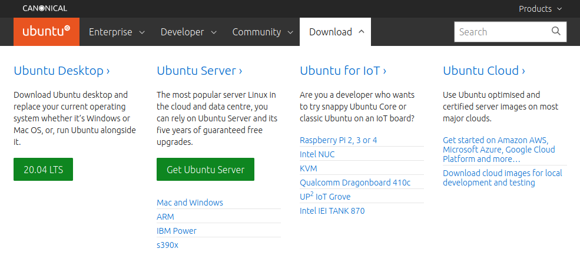
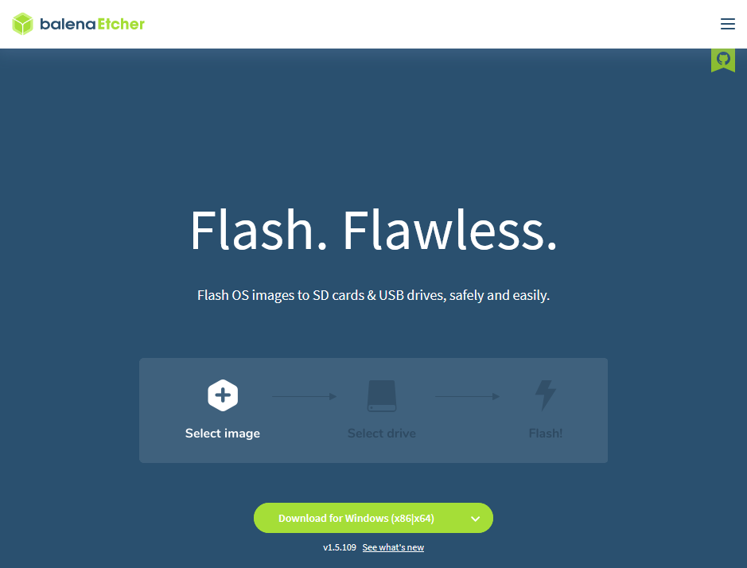
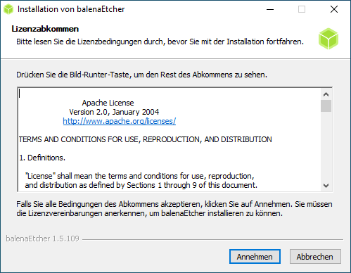
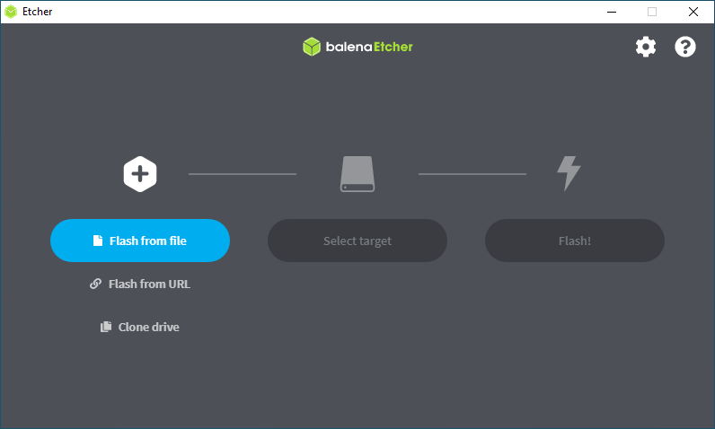
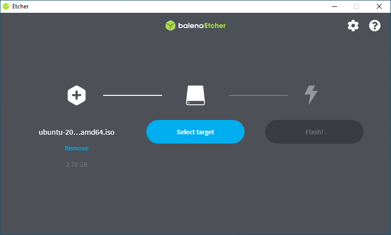
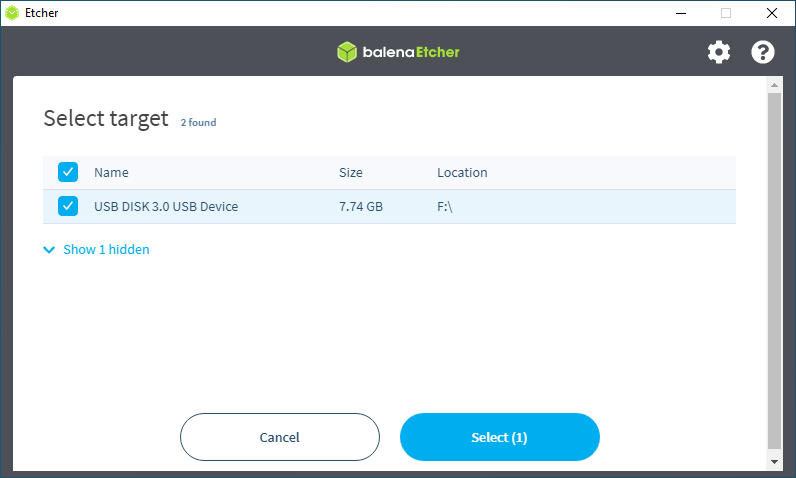
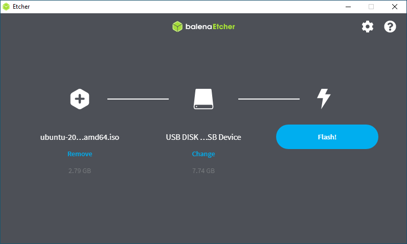
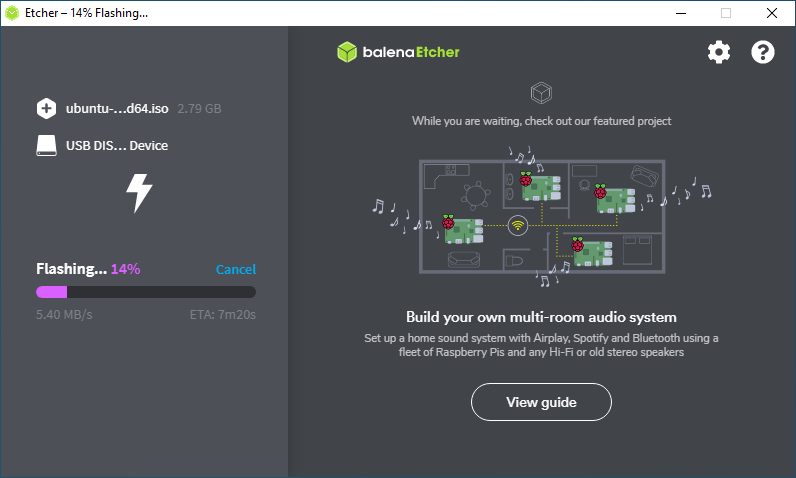
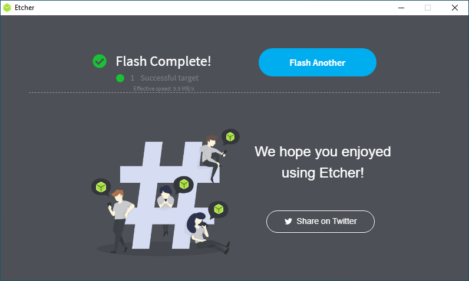

# 5.4.4 Linux ausprobieren
---

## Hintergrund
Da Linux ein Betriebssystem ist, kann es leider nicht so einfach wie z.B. ein Browser oder ein Office-Programm auf dem eigenen Computer installiert werden. Um Linux permanent zu nutzen, muss Linux neben Windows in einer eigenen Partition (einem separaten Bereich auf der Festplatte) installiert werden oder Windows ganz ersetzen. Dieser Schritt sollte gut überlegt und vorbereitet sein (insbesondere braucht es ein Backup sämtlicher Daten!).

Wir schlagen vor, Linux mit einem sogenannten «Live-System» auszuprobieren. Dazu sind folgende Schritte nötig:

- USB-Stick vorbereiten (Linux Live-System auf den Stick installieren)
- Windows/macOS herunterfahren
- Linux vom USB-Stick starten

Das bedeutet, dass wir die bestehende Installation auf dem Computer nicht verändern, sondern nur temporär ein anderes Betriebssystem ab einem externen Datenträger booten. Möchten wir zu Windows/macOS zurückkehren, beenden wir das Live-System, entfernen den USB-Stick und starten wieder das gewohnte Betriebssystem.

## Linux herunterladen
Zuerst muss man sich für eine Linux-Distribution entscheiden. Wir verwenden für unser Unterrichtsprojekt **Ubuntu**[^1].

Auf der [Ubuntu-Webseite][1] klickt man auf den «Download»-Knopf:

Anschliessend kann ganz links unter «Desktop» die aktuellste Version (momentan **20.04 LTS**) heruntergeladen werden. Die Datei trägt die Endung `.iso`. Sie muss nun mit einem speziellen Verfahren auf den USB-Stick installiert werden.

::: warning Achtung
Die heruntergeladene Datei sollte **nicht direkt** auf den USB-Stick kopiert werden, sonst funktioniert das Live-System nicht!
:::

## Balena Etcher herunterladen
Die Software **Balena Etcher**[^2] übernimmt das Installieren der ISO-Datei auf den USB-Stick. Auf der Balena-Webseite klicken wir grünen Download-Knopf und speichern die `.exe`-Datei im Downloads-Ordner ab:

## Balena Etcher installieren
Nun kann die Installation durch einen Doppelklick auf die Installationsdatei `balenaEtcher-Setup-x.y.z.exe` im Downloads-Ordner gestartet werden. Nach dem Akzeptieren der Lizenz dauert die Installation nur einen kurzen Augenblick.

## Linux auf den USB-Stick installieren
Nach dem Start von Balena Etcher muss nach einem Klick auf **Flash from file** zuerst die zu installierende Datei – also die vor kurzem heruntergeladene ISO-Datei – ausgewählt werden.

Anschliessend wird der gewünschte USB-Stick eingesteckt und nach einem Klick auf **Select target** ausgewählt:

Schliesslich wird der Installationsvorgang durch einen Klick auf **Flash!** gestartet:

::: warning Achtung
Sämtliche Daten auf dem USB-Stick gehen dabei verloren! Bitte vorher unbedingt ein **Backup** erstellen.
:::

Bitte den USB-Stick erst ausziehen, wenn der Installationsprozess komplett abgeschlossen ist.

[1]: https://ubuntu.com/

[^1]: [Ubuntu](https://ubuntu.com/)
[^2]: [Balena Etcher](https://www.balena.io/etcher/)
