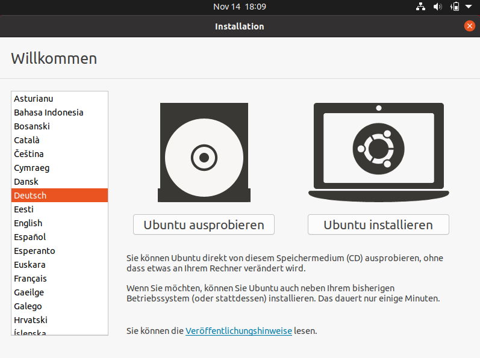
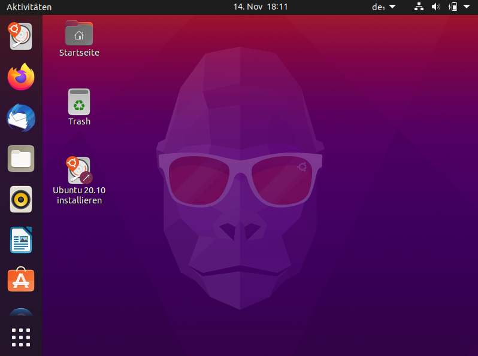
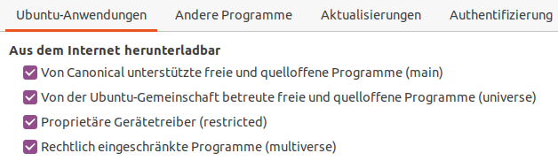
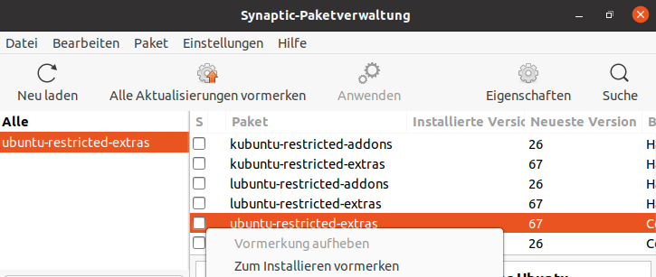

# 5.4.5 Aufgaben
---

Zuerst muss Linux gestartet werden. Dazu setzt du am einfachsten einen USB-Stick mit einem Live-System ein, damit das installierte Windows auf deinem Computer nicht verändert wird. Du erhältst den USB-Stick entweder von deiner Lehrperson oder kannst ihn – wie im vorherigen [Kapitel](?page=../4-install%2FREADME) beschrieben – selbst herstellen.

Vorgehen:

1. Falls der Computer bereits gestartet ist, musst du ihn zuerst herunterfahren.
2. Stecke den USB-Stick ein.
3. Starte den Computer. Nun sollte nicht Windows gestartet, sondern Folgendes angezeigt werden:

   
4. Wähle links bei _Sprache_ _Deutsch_ aus und klicke auf den Knopf _Linux ausprobieren_.

   ::: warning Achtung
   Wenn du _Linux installieren_ anklickst und nicht aufpasst, wird der Inhalt der Festplatte wahrscheinlich überschrieben und du verlierst deine Daten.
   :::

5. Sobald Linux gestartet ist, sieht die Benutzeroberfläche wie folgt aus. Nun kannst du mit dem Ausprobieren und dem Lösen der nachfolgenden Übungen beginnen.

   

## Kurz-Überblick über Ubuntu

<VueVideo id="BexdfZQVZuo"></VueVideo>

::: exercise Aufgabe Office
1. Öffne das Textverarbeitungsprogramm _LibreOffice Writer_. Du findest es links in der Favoritenleiste.
2. Auch in LibreOffice können Formatvorlagen eingesetzt werden, du findest sie im Dropdown-Menü links, das zu Beginn _Standard_ anzeigt. Schreibe den folgenden Titel `Linux – Mein erster Eindruck`, wähle dafür die Formatvorlage _Titel_ aus.
3. Schreibe darunter für jede Aufgabe eine Überschrift mit der Formatvorlage _Überschrift 1_ (Office, Internet, Dateien, Multimedia, ...) und halte im Verlaufe deiner Arbeit stichwortartig fest, wie dir das Arbeiten mit Linux gefällt und welche Probleme du antriffst.
4. Speichere das Dokument unter _Dokumente_ mit folgendem Namen: `Linux-Vorname-Nachname.odt`
5. Speichere diese Datei am Schluss der Lektion als **PDF** ab und schicke dieses per E-Mail an deine Lehrperson.
:::

::: exercise Aufgabe Internet
1. Öffne den _Firefox_-Browser und öffne diese Webseite, damit du mit die Aufgaben lösen kannst.
2. Suche im Internet ein Bild des Linux-Maskottchens *Tux*. Lade es herunter und füge es in dein Textdokument ein.
3. Lade den Film [*Codename GNU-Linux*](http://propaganda.2flub.org/video/Codename-GNU-Linux/Codename-GNU-Linux-german.avi) herunter (nicht direkt abspielen, wir brauchen ihn erst später).
:::

::: exercise Aufgabe Dateien
1. Öffne den Dateimanager _Dateien_ (links in der Favoritenleiste).
2. Suche den Ordner _Dokumente_ und darin das (von dir hoffentlich gespeicherte Dokument `Linux-Vorname-Nachname.odt`). Du musst es nicht öffnen, es sollte ja bereits geöffnet sein.
3. Öffne den Order _Downloads_. Hier werden die heruntergeladenen Dateien gespeichert. Da sollte auch das Bild von Tux und das heruntergeladene Video sein.
   1. Verschiebe das Bild in den Ordner _Bilder_.
   2. Verschiebe das Video in den Ordner _Videos_.
:::

::: exercise Aufgabe Multimedia
1. Spiele das heruntergeladene Video ab.

   → Es ist richtig, dass nur Ton ausgegeben, aber kein Bild angezeigt wird.

   **Hintergrund**: Das Video ist mit einem nicht-freien Verfahren codiert, so dass Ubuntu dies nicht direkt abspielen kann.

2. Springe zu den Aufgaben zu _Software installieren_ (weiter unten), führe die gesamte Aufgabe durch und komme anschliessend wieder hierher zurück.
3. Spiele das Video erneut ab, nun sollte auch das Bild angezeigt werden. Springe vor zur Zeit 15:10 und schaue dir die nächsten 2 Minuten an (bis 16:55). Die Szene zeigt, wie der Name _Linux_ entstanden ist.
:::

::: exercise Aufgabe Software installieren
1. Zusätzliche Paketquellen aktivieren und den Softwarekatalog aktualisieren (letzteres passiert jeweils nach ein paar Stunden automatisch).
   1. Klicke oben links auf _Aktivitäten_ und tippe `Anwendungen` ins Suchfeld. Klicke auf das Icon mit dem 'A'.
   2. Setze beim 2. und 4. Eintrag (_Universe_ und _Multiverse_) je ein Gutzeichen und klicke auf _Schliessen_. Damit werden zusätzliche Softwarepakete verfügbar, die auch Programmcode enthalten, der nicht unter einer freien Lizenz steht. Leider ist dies gerade im Multimediabereich und bei den Gerätetreibern oft notwendig.

   

   3. Im neuen Fenster klickst du auf den Knopf _Neu laden_.
   4. Nachdem der Aktualisierungsvorgang abgeschlossen ist, kannst du das Fenster schliessen.
2. _Synaptic_ (bessere und umfangreichere Paketverwaltung als die vorhin verwendete) installieren.
   1. Klicke links in der Favoritenleiste auf das Icon _Ubuntu Software_.
   2. Nach einem Klick oben auf die Lupe kannst du nach `Synaptic` suchen.
   3. Nun kannst du den Eintrag _Synaptic Paketverwaltung_ markieren und anschliessend den Knopf _Installieren_ anklicken.
   4. Nach erfolgter Installation musst du dieses Fenster schliessen.
3. Zusätzliche Video-Codecs installieren.
   1. Starte _Synaptic_ (bei _Aktivitäten_ nach `Synaptic` suchen).
   2. Rechts bei der Lupe kannst du nach dem Paket `ubuntu-restricted-extras` suchen.

      Es enthält unter anderen Microsoft-Schriftarten (Arial, ...), Audio- und Video-Codecs.

   3. In der Liste der Suchresultate klickst du zuvorderst auf Kästchen beim richtigen Eintrag und wählst _Zum Installieren vormerken_ und bestätigst das nächste Fenster mit dem Knopf _Vormerken_.

      

   4. Zum Schluss klickst du oben auf den Knopf _Anwenden_ (und bei der Zusammenstellung nochmals auf _Anwenden_).
   5. Nach dem Herunterladen musst du noch eine Lizenzvereinbarung akzeptieren, damit die Installation ausgeführt wird.
:::

::: exercise Spiele
1. Starte den Synaptic-Paketmanager und suche das Spiel `billard-gl`. Installiere das Paket und probiere das Spiel aus.
:::

::: exercise Zusatzaufgabe
1. Wenn du willst, kannst du noch einen speziellen Video-Effekt (genannt *Ascii-Arts*) erzeugen:
   1. Lade folgende drei Videos herunter:
      - [Stadt](https://media.mygymer.ch/videos/city.mp4)[^1]
      - [Yoga](https://media.mygymer.ch/videos/yoga.mp4)[^2]
      - [Diskussion](https://media.mygymer.ch/videos/couple.mp4)[^3]
   2. Schaue die drei Videos zuerst im normalen Videoplayer.
   2. Installiere mit _Synaptic_ das Paket `mplayer`.
   3. Nun kannst du ein _Terminal_ öffnen.
   4. Tippe im Terminal den folgenden Befehl ein (alle Zeichen sind wichtig, inkl. Gross-/Kleinschreibung!) und drücke dann [Enter]: `DISPLAY= mplayer -vo caca -quiet Downloads/city.mp4`
   5. Spiele auch die anderen beiden Videos ab, indem du den Befehl oben entsprechend anpasst (du kannst die Taste [Up] drücken, damit du den Befehl nicht erneut abtippen musst).
:::

[^1]: Quelle: [Pixabay – Stadt](https://pixabay.com/de/videos/stadt-menschen-wandern-einkaufen-999/)
[^2]: Quelle: [Pixabay – Yoga](https://pixabay.com/de/videos/yoga-gesundheit-%C3%BCbung-frau-berg-445/)
[^3]: Quelle: [Pixabay – Diskussion](https://pixabay.com/de/videos/p%C3%A4rchen-vertrauen-gespr%C3%A4ch-reden-19706/)
