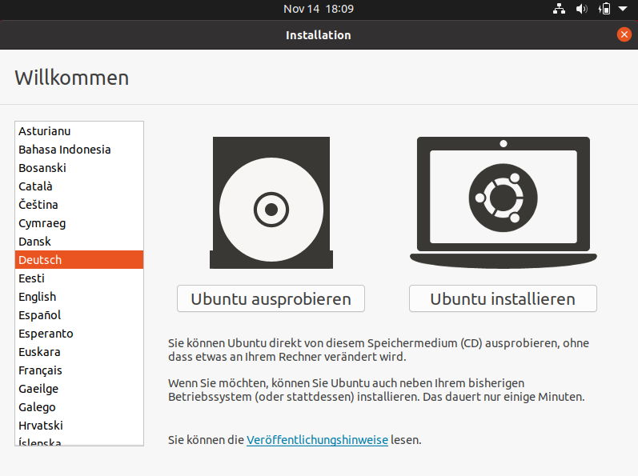
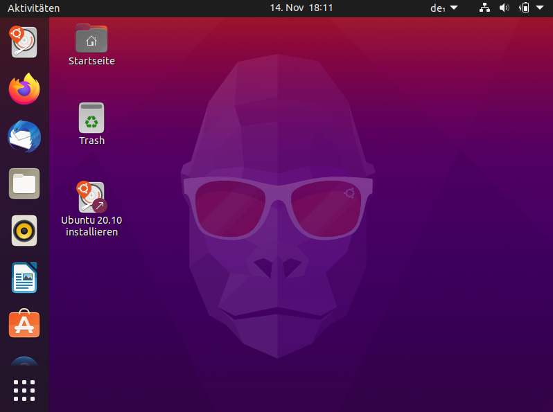

# Linux starten
---

Zuerst muss Linux gestartet werden. Dazu setzt du am einfachsten einen USB-Stick mit einem Live-System ein, damit das installierte Windows auf deinem Computer nicht verändert wird. Du erhältst den USB-Stick entweder von deiner Lehrperson oder kannst ihn – wie im vorherigen [Kapitel](?page=../4-install%2FREADME) beschrieben – selbst herstellen.

Vorgehen:

1. Falls der Computer bereits gestartet ist, musst du ihn zuerst herunterfahren.
2. Stecke den USB-Stick ein.
3. Starte den Computer. Nun sollte nicht Windows gestartet, sondern Folgendes angezeigt werden:

   
4. Wähle links bei _Sprache_ _Deutsch_ aus und klicke auf den Knopf _Linux ausprobieren_.

   ::: warning Achtung
   Wenn du _Linux installieren_ anklickst und nicht aufpasst, wird der Inhalt der Festplatte wahrscheinlich überschrieben und du verlierst deine Daten.
   :::

5. Sobald Linux gestartet ist, sieht die Benutzeroberfläche wie folgt aus. Nun kannst du mit dem Ausprobieren und dem Lösen der nachfolgenden Übungen beginnen.

   
