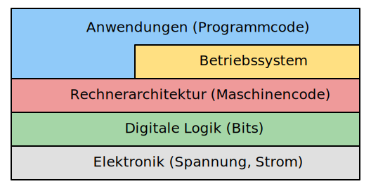

# Computer
---

> Computer sind unglaublich schnell, genau und dumm. Menschen sind unglaublich langsam, ungenau und brillant. zusammen sind sie mächtig jenseits aller Vorstellungskraft.
>
> *– Albert Einstein*

## Inhalt
* [1 Grundlagen](?page=1-basics/)
* [2 Elektronik](?page=2-electronics/)
* [3 Digitale Logik](?page=3-gates/)
* [4 Rechnerarchitektur](?page=4-architecture/)
* [5 Betriebssysteme](?page=5-os/)
* [6 Geschichte](?page=6-history/)

## Ebenen

Wie die Netzwerken kann auch die Hardware auf verschiedenen **Ebenen** betrachtet werden:

Auf der Ebene der **Elektronik** werden die Zustände 0 und 1 durch unterschiedliche Spannungen dargestellt. Das grundlegende Bauelement für digitale Schaltungen ist der **Transistor**.

In der **digitalen Logik** werden aus den Grundelementen (**logische Gatter**) komplexe Schaltungen aufgebaut, welche Zahlen addieren oder Werte speichern können.

Die **Rechnerarchitektur** legt fest, wie verschiedene Bauelemente wie Rechenwerk und Speicher miteinander verknüpft werden und in welcher zeitlichen Abfolge Daten untereinander ausgetauscht werden. Daraus ergeben sich die grundlegenden Befehle (Maschinencode), welche der Computer versteht.

Das **Betriebssystem** kontrolliert und koordiniert den Zugriff auf Speicher und Prozessor für die verschiedenen Anwendungen, welche auf dem Computer ausgeführt werden. Es stellt grundlegende Funktionen wie die Dateiverwaltung und Netzwerkkommunikation zu Verfügung.
