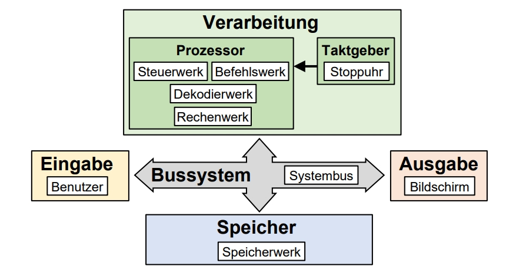

# CPU-Rollenspiel
---

## Material

* [:pdf: Hinweise für die LP](./Neumann-Rollenspiel-Hinweise-LP.pdf)
* [:docx: Hinweise für die lP](./Neumann-Rollenspiel-Hinweise-LP.docx)
* [:pdf: Druckvorlage](./Neumann-Rollenspiel-Druckvorlage.pdf)
* [:docx: Druckvorlage](./Neumann-Rollenspiel-Druckvorlage.docx)

## Von Neumann

Es ist empfehlenswert, zuerst die Von-Neumann-Architektur zu behandeln.

## Rollen
Vorgesehen sind 5-9 Rollen pro Rollenspiel-Gruppe, d.h. 2 bis 4 Rollenspiel-Gruppen pro Klasse. Die Rollen sind im Einzelnen:
- Steuerwerk
- Befehlswerk
- Speicherwerk
- Dekodierwerk
- Rechenwerk
- Systembus (auch passiv umsetzbar – es liegt ein Notizzettel «Systembus» in der Tischmitte, auf den alle zugreifen können)
- Benutzer (nur bei Programm 2/3; falls zu wenig Personen: Bildschirm spielt auch den Benutzer)
- Stoppuhr (auch nachträglich umsetzbar – es wird dann nach dem Rollenspiel abgeschätzt, wie lange eine Runde gebraucht hat)
- Bildschirm (auch passiv umsetzbar – es liegt dann einfach ein Bildschirm-Notizzettel auf dem Tisch)

*Tipp*: Für den Systembus braucht es wohl keinen Sitzplatz, die Person muss sich zwischen den Komponenten hin- und herbewegen.

## Vorbereitung / Materialien
- Die Rollenanleitungen, Speicher-Karten und Befehlsstreifen sind im Dokument Neumann-Rollenspiel-Druckvorlage zum Drucken und Ausschneiden vorbereitet
- Stifte und Notizpapier für mehrere der Rollen

## Programme
Für das Rollenspiel stehen vier Programme zur Verfügung:
- Programm 1 (wohl nicht nötig):
  Es werden zwei Zahlen addiert und auf dem Bildschirm angezeigt
- Programm 2:
  Es werden zwei vom Benutzer eingegebene Zahlen addiert und auf dem Bildschirm angezeigt
- Programm 3:
  Der Benutzer muss solange eine Zahl eingeben (erraten), bis sie stimmt
- Programm 4 (nur wenn genügend Zeit):
  Es werden die Zahlen 02, 04, 06, 08, 10 nacheinander auf dem Bildschirm angezeigt

## Vorschlag Rollenspiel-Ablauf
- Einführung in Computeraufbau, EVAS-Prinzip und von Neumann-Architektur.
- Phase 1: Beispiel 1 (ohne Kenntnis, was das Programm tut)
  - Die anwesenden Schülerinnen und Schüler werden geeignet in Gruppen eingeteilt und die Rollen werden verteilt. Alle lesen nur die eigenen Anweisungen.
  - Die Speicheradressen-Karten und die Befehlstreifen der «Basis-Sprache» bekommt das Speicherwerk resp. Dekodierwerk.
- Phase 2: Erkenntnis diskutieren
  - Was ist alles passiert? Was hat das Programm gemacht?
  - Was man bis hier verstehen sollte
    - Fetch-Decode-Execute Prinzip
    - Speicher unterteilt in Programmcode und Daten
- Phase 3: Beispiel 2
  - Speicherwerk und Dekodierwerk erhalten die Speicheradressen-Karten resp. Befehlstreifen der "Erweiterten Sprache".
- Phase 4: Abschliessende Diskussion (zentrale Punkte siehe unten)

## Abschliessende Diskussion
Hier kann z.B. der Vergleich zu einer richtigen CPU gemacht werden. Die Stoppuhr hat für jede Runde notiert, wie lange diese gedauert hat (oder die Zeit wird nachträglich abgeschätzt). Eine richtige CPU arbeitet mit ca. 3 Milliarden Taktzyklen pro Sekunde.

**Zentrale Punkte**:
- Ein Computer kann nur wenige, simple Dinge, dafür in horrendem Tempo.
- Ein Programm besteht aus unzähligen, sehr simplen Anweisungen (= lauter Zahlen)
- Fetch-Decode-Execute-Prinzip
- Was ist der Unterschied zwischen den 10 Anweisungen des Steuerwerks und den Anweisungen, die das Steuerwerk vom Dekodierwerk erhält?
  - die 10 Anweisungen sind allgemein und immer gleich (= Ablauf eines Taktes)
  - die Befehle, die das Dekodierwerk liefert, kommen aus dem Speicher (= Programm)
